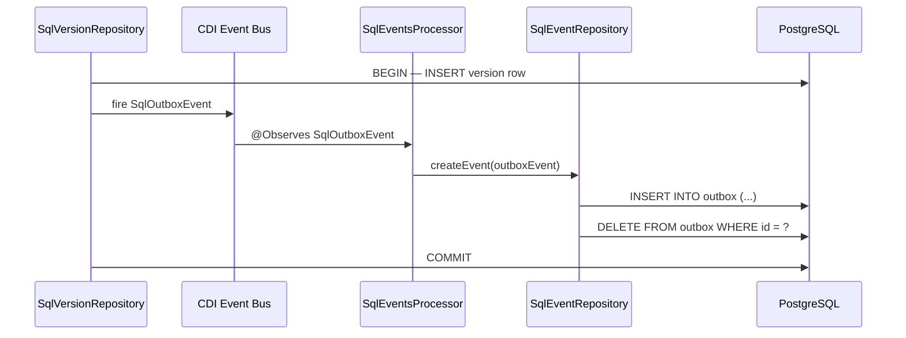
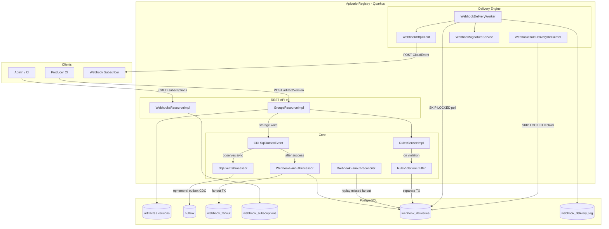
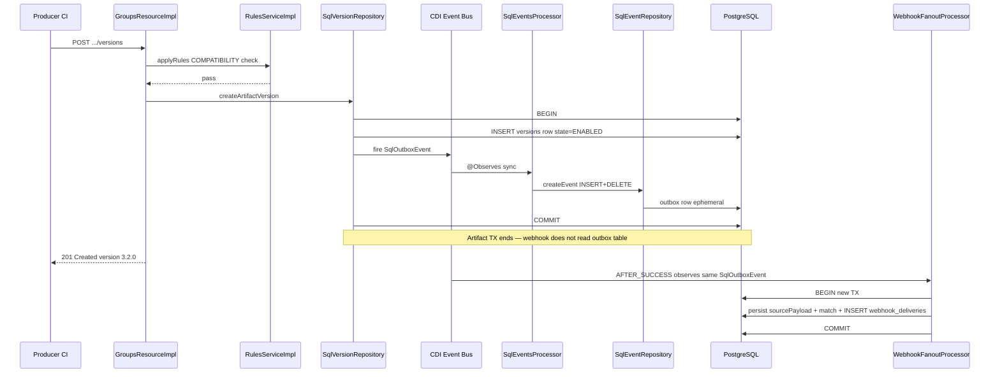
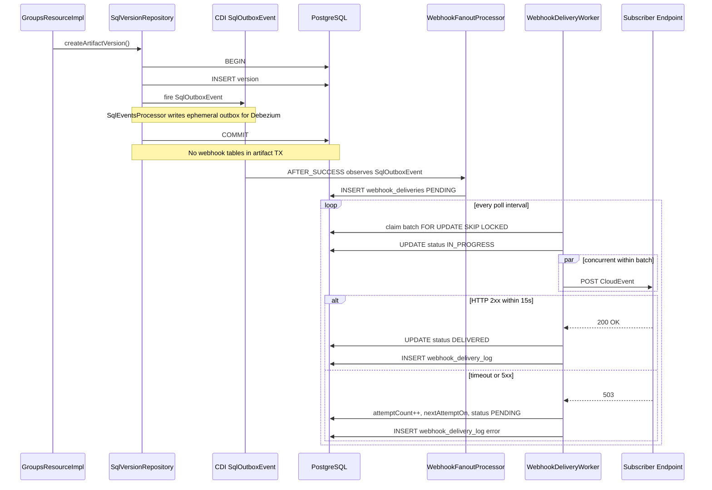
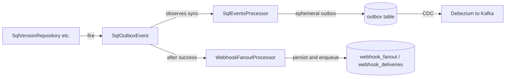
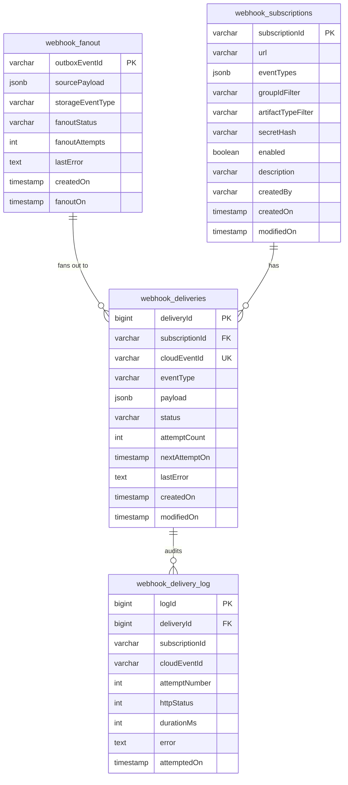

# CloudEvents Webhook Notifications — Design Package

**Status:** Pre-implementation review
**Audience:** Engineering team
**Scope:** SQL storage variant (PostgreSQL primary); feature disabled on H2/KafkaSQL/GitOps/KubernetesOps
**Stack:** Java 17 / Quarkus 3.27, PostgreSQL, CloudEvents 1.0, REST v3, Testcontainers

---

## Elevator Pitch

Apicurio Registry already records every artifact, version, and rule change as an internal database event — but today those events only leave the registry if you run Debezium CDC and Kafka yourself. This project adds a **first-class webhook notification system**: operators register HTTPS endpoints, pick which CloudEvents they care about, and the registry delivers them reliably with retries — no external streaming stack required. Teams get push-based schema-change alerts in seconds instead of discovering breakage hours later through polling or production crashes.

---

## 0. Baseline Context — What Exists Today

Before describing what we are building, this section establishes **what Apicurio Registry already has** that the webhook system plugs into, and **why** the statement *"change events exist internally (outbox)"* (see §1.3) is accurate.

### 0.1 Registry change events are a first-class storage concern

Apicurio Registry is a schema and API contract store. Every meaningful state mutation — artifact created, version published, metadata updated, rule configured, version state changed — flows through the SQL storage layer (`SqlArtifactRepository`, `SqlVersionRepository`, `SqlRuleRepository`, etc.). These repositories do not silently mutate rows; they **emit structured change notifications** as part of the write path.

The event taxonomy is defined in `[StorageEventType.java](app/src/main/java/io/apicurio/registry/storage/StorageEventType.java)` (17 values today, including `ARTIFACT_CREATED`, `ARTIFACT_VERSION_CREATED`, `ARTIFACT_VERSION_STATE_CHANGED`, `ARTIFACT_METADATA_UPDATED`, `ARTIFACT_DELETED`, and rule/group/contract events). Each event carries a JSON payload built by typed classes under `[app/src/main/java/io/apicurio/registry/events/](app/src/main/java/io/apicurio/registry/events/)` (e.g. `ArtifactVersionCreated`, `ArtifactVersionStateChanged`).

This is documented for operators in `[assembly-registry-events.adoc](docs/modules/ROOT/pages/getting-started/assembly-registry-events.adoc)`.

### 0.2 The transactional outbox pattern (and why rows do not persist)

On PostgreSQL and MSSQL, change events are written using the **transactional outbox pattern**:




**Step-by-step (what the code does today):**

1. A storage repository completes its data write and fires `SqlOutboxEvent.of(...)` via CDI (`Event<SqlOutboxEvent>`).
2. `[SqlEventsProcessor](app/src/main/java/io/apicurio/registry/storage/impl/sql/SqlEventsProcessor.java)` observes the event and delegates to `[SqlEventRepository.createEvent()](app/src/main/java/io/apicurio/registry/storage/impl/sql/repositories/SqlEventRepository.java)`.
3. `createEvent()` runs **INSERT then DELETE** on the `outbox` table within the same database transaction as the registry write:

```java
handle.createUpdate(sqlStatements.createOutboxEvent())...execute();
handle.createUpdate(sqlStatements.deleteOutboxEvent())...execute();
```

1. The `outbox` table (`[postgresql.ddl](app/src/main/resources/io/apicurio/registry/storage/impl/sql/postgresql.ddl)`, added in migration 101) has columns: `id`, `aggregatetype`, `aggregateid`, `type`, `payload` (JSONB).

**Why INSERT+DELETE?** This is the standard Debezium transactional outbox design: the INSERT is captured by Change Data Capture (CDC) as a change event; the DELETE prevents unbounded table growth. Rows are **ephemeral** — they exist only for the duration of the transaction. There is no outbox retention table to query later; the event's lifecycle continues in **external** infrastructure (Debezium → Kafka topic configured via `apicurio.events.kafka.topic`).

**Justifying "change events exist internally":** The registry **does** produce change events at the storage layer on every relevant mutation. The gap is not "events don't exist" — it is that **delivery to application teams requires operators to deploy and operate Debezium + Kafka** (or use KafkaSQL storage, which publishes directly to a Kafka topic). There is no built-in HTTP push, no subscription model, and no standard event envelope.

### 0.3 What we are building upon (reuse, not rewrite)


| Existing capability | Location                                                                                                       | How webhooks use it                                                                                                        |
| ------------------- | -------------------------------------------------------------------------------------------------------------- | -------------------------------------------------------------------------------------------------------------------------- |
| Storage write hooks | `SqlOutboxEvent` CDI events from repositories                                                                  | `WebhookFanoutProcessor` **observes the same CDI `SqlOutboxEvent`** as `SqlEventsProcessor` (Debezium path) — **does not read the `outbox` table** |
| Event payloads      | `app/.../events/*.java` + `StorageEventType`                                                                   | `CloudEventsMapper` translates existing JSON into CloudEvents v1.0 envelopes                                               |
| HTTP client         | `[HttpClientService](app/src/main/java/io/apicurio/registry/http/HttpClientService.java)` + Vert.x `WebClient` | `WebhookHttpClient` reuses the same `WebClientProducer` connection pool                                                    |
| Scheduled workers   | `UsageTelemetryBuffer`, `DownloadReaper`                                                                       | `WebhookDeliveryWorker` follows the same `@Scheduled` + PostgreSQL pattern                                                 |
| Admin REST patterns | `[AdminResourceImpl](app/src/main/java/io/apicurio/registry/rest/v3/impl/AdminResourceImpl.java)`              | `WebhooksResourceImpl` under `/admin/webhooks` with `@Authorized` RBAC                                                     |
| SQL migrations      | Custom DDL upgrades (`db-version` currently 107)                                                               | Migration 108 adds `webhook_subscriptions`, `webhook_fanout`, `webhook_deliveries`, `webhook_delivery_log`                 |
| OpenAPI-first DTOs  | `[openapi.json](common/src/main/resources/META-INF/openapi.json)`                                              | Subscription and delivery schemas added alongside existing v3 API models                                                   |


### 0.4 What does not exist today (the gap this project fills)


| Gap                                     | Impact                                                                                                                 |
| --------------------------------------- | ---------------------------------------------------------------------------------------------------------------------- |
| No webhook subscription API             | Teams cannot register callback URLs in the registry itself                                                             |
| No event-type or group/artifact filters | Debezium consumers receive all events on the topic                                                                     |
| No CloudEvents envelope                 | Payloads are registry-specific JSON (`eventType`, `groupId`, etc.) — not interoperable with standard event routers     |
| No HTTP delivery engine                 | No retries, delivery logs, or dead-letter handling inside the registry                                                 |
| Rule violations are sync-only           | `RuleViolationException` returns HTTP 400 to the caller; governance teams are not notified of attempted bad publishes  |
| Outbox rows are ephemeral               | Cannot replay missed deliveries from the `outbox` table — webhook fanout must persist its own `sourcePayload` snapshot |


**This project's scope:** Add subscription management, CloudEvents mapping, a PostgreSQL-backed delivery queue with at-least-once semantics and exponential backoff, monitoring/admin APIs, and integration tests — **without modifying** the existing outbox CDC path or artifact write transactions.

---

# Deliverable 1 — Problem & Impact Analysis

## 1.1 Representative Failure Scenario (Modeled, Not Historical)

This section models a **class of failure** the feature prevents. It is not a postmortem of a specific past incident.

### Scenario: Silent backward-incompatible Avro schema publish

**Actors:**

- **Registry:** Apicurio Registry v3, SQL/PostgreSQL, `COMPATIBILITY=BACKWARD` rule configured at group level
- **Producer team:** Publishes `orders-v2` Avro schema Friday 17:45 UTC (removes optional field `customerTier`)
- **Consumer fleet:** 12 microservices deserializing `orders` topic via Apicurio serdes; no schema-change alerting
- **Ops:** Weekly registry audit script polls `GET /groups/prod/artifacts/orders/versions` every 6 hours

### Timeline


| Time (UTC) | Event                                                                                                                                                    | Who knows?                                |
| ---------- | -------------------------------------------------------------------------------------------------------------------------------------------------------- | ----------------------------------------- |
| T+0 min    | Producer CI publishes incompatible schema. Compatibility rule is **disabled** on this artifact (misconfigured override). Version `3.1.0` goes `ENABLED`. | Producer CI only                          |
| T+2 min    | New producers start serializing without `customerTier`. Kafka accepts messages.                                                                          | Producer team                             |
| T+18 min   | First consumer (`billing-service`) restarts, fetches latest schema from registry, deserializes new messages → `SerializationException`. Pod crash-loops. | billing-service on-call (if alerts exist) |
| T+45 min   | 4 more consumers hit same failure as they roll during deployment window. Kafka consumer lag spikes.                                                      | Partial fleet                             |
| T+3 hr     | Ops polling script runs; notices version count changed. Manual investigation begins.                                                                     | Ops (delayed)                             |
| T+5 hr     | Root cause identified; rollback to `3.0.0` + redeploy consumers. Estimated 2.1M poisoned/skipped records requiring replay.                               | All teams                                 |


### What breaks


| Layer             | Failure mode                                                           |
| ----------------- | ---------------------------------------------------------------------- |
| Kafka consumers   | `SerializationException` / `AvroTypeException` on deserialize          |
| Stream processors | Flink/Kafka Streams state corruption if partial processing occurred    |
| Downstream APIs   | Stale contract assumptions; 5xx from services expecting `customerTier` |
| Data pipelines    | Warehouse ingestion stalls; SLA breach on daily aggregates             |
| CI/CD             | No gate fired — pipeline green while runtime broken                    |


### Detection delay & cost of delay


| Detection method                                               | Typical delay                                | Cost driver                                                               |
| -------------------------------------------------------------- | -------------------------------------------- | ------------------------------------------------------------------------- |
| **Polling registry API** (6h interval)                         | 0–6 hours                                    | Full consumer fleet may already be degraded                               |
| **Kafka consumer lag alerts**                                  | 15–60 min after first crash                  | Requires correlation to schema change (non-obvious)                       |
| **Push webhook on `version.published`**                        | 2–10 seconds (delivery worker poll interval) | Teams can block deploy, page owners, trigger automated compatibility gate |
| **Push webhook on `rule.violated`** (if rule had been enabled) | Immediate (sync reject + async notify)       | Prevents bad schema from ever reaching `ENABLED`                          |


**Blast radius quantification (representative mid-size deployment):**

- 12 consumer services × ~3 pods = 36 failing replicas
- 1 schema × N topics referencing it (often 1–5)
- Replay cost: millions of records × reprocessing compute
- Human cost: 3–8 engineer-hours incident response
- **Preventable if notification arrived before producer rollout completed**

## 1.2 Root Cause

**Primary root cause:** Registry state changes are not pushed to interested parties. Downstream systems discover changes only through pull (polling, restart-time schema fetch, or runtime failure).

**Contributing factors in the current Apicurio architecture:**

1. **Outbox events require external infrastructure** — PostgreSQL outbox + Debezium + Kafka (`[assembly-registry-events.adoc](docs/modules/ROOT/pages/getting-started/assembly-registry-events.adoc)`). Application teams without this stack get nothing.
2. **Event format is registry-specific JSON** — not CloudEvents; not consumable by standard event routers without custom adapters.
3. **No subscription/filter model** — even Debezium consumers receive all event types on the topic.
4. **Rule violations are synchronous-only** — `[RuleViolationException](schema-util/common/src/main/java/io/apicurio/registry/rules/violation/RuleViolationException.java)` returns HTTP 400 to the caller; security/governance teams are not notified of attempted bad publishes.

## 1.3 Five Whys (Causal Chain)


| #   | Why                                                        | Answer                                                                                                                                                                                |
| --- | ---------------------------------------------------------- | ------------------------------------------------------------------------------------------------------------------------------------------------------------------------------------- |
| 1   | Why did consumers fail in production?                      | They deserialized messages against an incompatible schema.                                                                                                                            |
| 2   | Why was the incompatible schema available?                 | A new version was published and enabled in the registry.                                                                                                                              |
| 3   | Why didn't consumers protect themselves before processing? | They fetch "latest" schema on restart; no pre-deploy notification or gate.                                                                                                            |
| 4   | Why was there no pre-deploy notification?                  | Registry has no push-based webhook to consumer-owned endpoints.                                                                                                                       |
| 5   | Why doesn't the registry push notifications?               | **Architectural gap:** change events exist internally via the transactional outbox (see §0.2), but there is no first-class HTTP subscription + delivery system for application teams. |


**Fix at root:** Add a managed webhook notification system with filtered subscriptions, CloudEvents payloads, and guaranteed delivery retries.

## 1.4 What Exists Today (Baseline)

See **§0 Baseline Context** for the full explanation of the outbox pattern, code paths, and reuse map. Summary table:


| Mechanism                    | Location                                                                                                                                                                                                            | Limitation                                          |
| ---------------------------- | ------------------------------------------------------------------------------------------------------------------------------------------------------------------------------------------------------------------- | --------------------------------------------------- |
| Transactional outbox         | `[outbox` table](app/src/main/resources/io/apicurio/registry/storage/impl/sql/postgresql.ddl), `[SqlEventRepository](app/src/main/java/io/apicurio/registry/storage/impl/sql/repositories/SqlEventRepository.java)` | PostgreSQL/MSSQL only; needs Debezium               |
| 17 `StorageEventType` values | `[StorageEventType.java](app/src/main/java/io/apicurio/registry/storage/StorageEventType.java)`                                                                                                                     | Custom JSON, no CloudEvents                         |
| Custom artifact webhooks     | `[HttpClientService](app/src/main/java/io/apicurio/registry/http/HttpClientService.java)`                                                                                                                           | Inbound validation only, not outbound notifications |
| Scheduled workers            | `[UsageTelemetryBuffer](app/src/main/java/io/apicurio/registry/rest/UsageTelemetryBuffer.java)`, `[DownloadReaper](app/src/main/java/io/apicurio/registry/downloads/DownloadReaper.java)`                           | Proven `@Scheduled` pattern to reuse                |


---

# Deliverable 2 — Solution Design

## 2.1 System Architecture




### 2.1.1 Production Dry Run — Walkthrough

This section traces a **realistic production scenario** through every component in the diagram above. Read it alongside the architecture diagram: each step names the component, what it does, and why it exists as a separate piece rather than being folded into something else.

#### Cast of characters


| Actor                            | Role in this scenario                                                                                           |
| -------------------------------- | --------------------------------------------------------------------------------------------------------------- |
| **Platform admin (Priya)**       | Registers webhook subscriptions via CI/CD                                                                       |
| **Producer CI (GitHub Actions)** | Publishes a new Avro schema version for `prod/orders`                                                           |
| **Apicurio Registry**            | 3 Quarkus pods behind a load balancer, PostgreSQL backend, `apicurio.webhooks.enabled=true`                     |
| **schema-guard-service**         | Internal webhook subscriber owned by the consumer platform team; receives CloudEvents and gates deployments     |
| **billing-service**              | Kafka consumer fleet that would break on incompatible schemas (does not talk to registry directly in this flow) |


#### Pre-condition: subscription setup (one-time, days earlier)

Priya's team runs a Terraform apply that calls the registry:

```http
POST /apis/registry/v3/admin/webhooks/subscriptions
Authorization: Bearer <admin-token>

{
  "url": "https://schema-guard.internal.example.com/hooks/apicurio",
  "eventTypes": [
    "io.apicurio.registry.artifact.version.published.v1",
    "io.apicurio.registry.rule.violated.v1"
  ],
  "groupId": "prod",
  "artifactType": "AVRO",
  "description": "Prod Avro publish alerts for deployment gate"
}
```

**What happens inside the registry:**


| Step | Component                              | Why this component exists                                                                                                                                                      |
| ---- | -------------------------------------- | ------------------------------------------------------------------------------------------------------------------------------------------------------------------------------ |
| 1    | `**WebhooksResourceImpl**`             | Dedicated REST surface for subscription CRUD. Separated from `AdminResourceImpl` (role mappings, import/export) to keep webhook concerns isolated and OpenAPI-discoverable.    |
| 2    | `**SqlWebhookSubscriptionRepository**` | Persists subscription config in PostgreSQL so it survives pod restarts and is shared across all 3 registry replicas. In-memory config would be lost on redeploy.               |
| 3    | `**webhook_subscriptions` table**      | Durable store for URL, filters, secret hash, enabled flag. Without a table, there is nothing for the delivery engine to match against.                                         |
| 4    | Response includes `secret: whsec_...`  | Returned once (Stripe/GitHub pattern). `WebhookSignatureService` will use this later so `schema-guard-service` can verify payloads were sent by the registry, not an attacker. |


No delivery happens yet. The subscription sits in PostgreSQL waiting for matching events.

---

#### Act 1 — Happy path: compatible schema published (Friday 17:45 UTC)

Producer CI runs:

```http
POST /apis/registry/v3/groups/prod/artifacts/orders/versions
Content-Type: application/json

{ "content": { ... Avro schema adding optional field "loyaltyPoints" ... }, "version": "3.2.0" }
```

##### Sequence (request thread — synchronous, must stay fast)




| Step | Time    | Component                    | What it does                                                             | Why not something else?                            |
| ---- | ------- | ---------------------------- | ------------------------------------------------------------------------ | -------------------------------------------------- |
| 1    | T+0ms   | `GroupsResourceImpl`         | REST entry point; validates request, calls rules, delegates to storage   | Already exists; webhook hooks downstream           |
| 2    | T+5ms   | `RulesServiceImpl`           | Runs BACKWARD compatibility                                              | Unchanged; producer gets immediate pass/fail       |
| 3    | T+15ms  | `SqlVersionRepository`       | Writes version row, fires `SqlOutboxEvent` via CDI                       | Canonical storage path                             |
| 4    | T+16ms  | `SqlEventsProcessor`         | `@Observes` same CDI event → `SqlEventRepository` INSERT+DELETE `outbox` (Debezium only) | Webhook is a **separate** observer; does not use this path |
| 5    | T+20ms  | PostgreSQL `COMMIT`          | Version committed; outbox row already deleted                            | Artifact write latency identical to today          |
| 6    | T+25ms  | Response to CI               | `201 Created`                                                            | CI completes before fanout runs                    |
| 7    | T+25ms+ | `WebhookFanoutProcessor`     | `AFTER_SUCCESS` on same `SqlOutboxEvent`: persist `sourcePayload` → match → enqueue | Independent observer; payload from CDI event in memory, not outbox table |
| 8    | T+26ms+ | `WebhookSubscriptionMatcher` | Filter by group/type/event                                               | Outside hot path; table growth affects fanout only |
| 9    | T+27ms+ | `CloudEventsMapper`          | Build CloudEvent; `cloudEventId` = UUID v5 from `outboxEventId` (§2.4.1) | Deterministic ID for reconciler replay             |


**Policy if fanout enqueue fails:** artifact write is already committed. Failure is logged; `webhook_fanout` stays `PENDING`. `WebhookFanoutReconciler` replays. **Webhook bugs never block core registry writes.**

**Benchmark gate (Phase 3):** artifact-create p99 with webhooks enabled within **+5ms** of baseline; fanout p99 with 100 subscriptions **< 200ms**.

**Why `schema-guard-service` does not receive the webhook yet:** the HTTP call happens on a background thread. Producer CI is not blocked waiting for `schema-guard-service` to wake up.

##### Sequence (background — delivery worker, T+2s to T+4s)

Registry pod `registry-2` runs `WebhookDeliveryWorker` (every `poll-every=2s`):

```mermaid
sequenceDiagram
    participant Worker as WebhookDeliveryWorker
    participant PG as PostgreSQL
    participant Signer as WebhookSignatureService
    participant Http as WebhookHttpClient
    participant Guard as schema-guard-service

    Worker->>PG: SELECT deliveries FOR UPDATE SKIP LOCKED
    Note over Worker,PG: Only registry-2 claims this row; registry-1 and registry-3 skip it
    Worker->>PG: UPDATE status IN_PROGRESS
    Worker->>Signer: HMAC-SHA256 body + timestamp
    Worker->>Http: POST application/cloudevents+json
    Http->>Guard: HTTPS with X-Apicurio-Webhook-Signature
    Guard-->>Http: 200 OK
    Worker->>PG: UPDATE status DELIVERED
    Worker->>PG: INSERT webhook_delivery_log attempt=1 httpStatus=200
```


| Step | Component                 | What it does                                          | Why it exists                                                    |
| ---- | ------------------------- | ----------------------------------------------------- | ---------------------------------------------------------------- |
| 1    | `WebhookDeliveryWorker`   | `@Scheduled` poller; claims batch via `SKIP LOCKED`   | Decouples delivery from API latency                              |
| 2    | `SKIP LOCKED` claim query | One pod per row per attempt                           | Prevents triple-delivery across replicas                         |
| 3    | **Concurrent dispatch**   | Vert.x `Future.all` within batch (max concurrency 10) | One slow subscriber cannot block unrelated deliveries (issue #3) |
| 4    | **Per-subscription cap**  | Max 3 in-flight HTTP per `subscriptionId`             | Fairness under multi-tenant load                                 |
| 5    | `WebhookSignatureService` | HMAC-SHA256 signing                                   | Subscriber authenticity                                          |
| 6    | `WebhookHttpClient`       | Async POST, 15s timeout, 2xx = success, no redirects  | Non-blocking I/O; SSRF guard before connect                      |
| 7    | `webhook_delivery_log`    | Immutable per-attempt audit                           | Ops visibility                                                   |


**What `schema-guard-service` does with the event (outside registry, but completes the story):**

1. Verifies HMAC signature and timestamp freshness
2. Dedup on CloudEvents `id` (at-least-once may redeliver)
3. Runs compatibility simulation against all known consumer contracts
4. Posts result to Slack: "orders 3.2.0 published — all 12 consumers compatible"
5. Unblocks the producer rollout pipeline

`**billing-service` never polled the registry.** It would have fetched the schema on next restart via `GET /ids/globalIds/{id}` — but by then `schema-guard` already validated compatibility. The webhook shortened the feedback loop from hours (polling) or post-crash (serdes fetch) to seconds.

---

#### Act 2 — Unhappy path: subscriber down, then retry succeeds

Suppose `schema-guard-service` is deploying and returns `503` for 90 seconds.


| Attempt | Time  | What happens                                        | DB state  |
| ------- | ----- | --------------------------------------------------- | --------- |
| 1       | T+2s  | POST → 503. `attemptCount=1`, `nextAttemptOn=T+7s`  | PENDING   |
| 2       | T+7s  | POST → 503. `attemptCount=2`, `nextAttemptOn=T+17s` | PENDING   |
| 3       | T+17s | POST → 200. `status=DELIVERED`                      | DELIVERED |


| Component                      | Role in retry                                                                                                 |
| ------------------------------ | ------------------------------------------------------------------------------------------------------------- |
| `**WebhookDeliveryWorker**`    | Respects `nextAttemptOn`; does not hammer a dead endpoint                                                     |
| **Exponential backoff config** | `5s → 10s → 20s → ...` capped at 1h. Borrowed from Stripe/GitHub retry philosophy                             |
| `**webhook_delivery_log**`     | 3 rows for this delivery: two 503s, one 200. Priya checks via `GET .../subscriptions/{id}/deliveries`         |
| **CloudEvents `id`**           | Same UUID across all 3 attempts. `schema-guard` deduplicates if attempt 1 actually succeeded but ack was lost |


**Why at-least-once, not exactly-once:** exactly-once HTTP delivery to an external system requires distributed transactions with the subscriber's database. No webhook system (GitHub, Stripe, Slack) guarantees exactly-once. The registry commits to: **never drop an event**; subscribers commit to: **handle duplicates via `id`**.

**Dead-letter:** if all 10 attempts fail, `status=DEAD_LETTER`. Event is not deleted. Ops investigates via delivery log. (Manual replay is a future enhancement.)

---

#### Act 3 — Alternate timeline: incompatible schema blocked + governance notified

Same producer CI, but this time compatibility rule is **enabled** and the schema removes field `customerTier`:

```http
POST /apis/registry/v3/groups/prod/artifacts/orders/versions
→ 400 Rule Violation (COMPATIBILITY/BACKWARD)
```


| Step | Component                   | What it does                                                                          | Why separate from Act 1 path                                                                                  |
| ---- | --------------------------- | ------------------------------------------------------------------------------------- | ------------------------------------------------------------------------------------------------------------- |
| 1    | `**RulesServiceImpl**`      | Compatibility check fails                                                             | Unchanged                                                                                                     |
| 2    | `**RuleViolationEmitter**`  | Builds `...rule.violated.v1` CloudEvent, enqueues delivery in a **separate short TX** | **No outbox row exists** — the version write was rejected. This is the only way to notify on failed publishes |
| 3    | `WebhookFanoutProcessor`    | Not involved on success path                                                          | Only runs on committed outbox events                                                                          |
| 4    | Response to CI              | `400` with `RuleViolationProblemDetails`                                              | Producer CI still gets immediate rejection (synchronous)                                                      |
| 5    | `**WebhookDeliveryWorker**` | Delivers `rule.violated.v1` to `schema-guard-service` ~2s later                       | Security/governance team gets async alert even though the write failed                                        |


**Concrete CloudEvent delivered to schema-guard:**

```json
{
  "type": "io.apicurio.registry.rule.violated.v1",
  "subject": "prod/orders",
  "data": {
    "ruleType": "COMPATIBILITY",
    "ruleConfiguration": "BACKWARD",
    "violations": [{ "description": "Field 'customerTier' was removed" }]
  }
}
```

**Why this matters for the §1.1 failure scenario:** with this subscription in place, the incompatible publish from §1.1 would have (a) been rejected by the rule, and (b) triggered a governance alert — even if someone misconfigured the artifact-level rule override, the `rule.violated` event still fires on the attempted write.

---

#### Act 4 — What each PostgreSQL table holds after Act 1


| Table                    | Rows after Act 1                                            | Purpose                                        |
| ------------------------ | ----------------------------------------------------------- | ---------------------------------------------- |
| `artifacts` / `versions` | `orders` v3.2.0 ENABLED                                     | Source of truth (unchanged)                    |
| `outbox`                 | **0 rows** (INSERT+DELETE in same TX — ephemeral by design) | Debezium CDC only; not a webhook replay source |
| `webhook_fanout`         | 1 row DONE with `sourcePayload` snapshot                    | Durable fanout replay source for reconciler    |
| `webhook_subscriptions`  | 1 row (Priya's subscription)                                | Configuration                                  |
| `webhook_deliveries`     | 1 row, status=DELIVERED                                     | Queue (terminal for this event)                |
| `webhook_delivery_log`   | 1 row, httpStatus=200                                       | Audit trail                                    |


---

#### Component cheat sheet (quick reference)


| Component                          | One-line purpose                                                 | If we removed it...                                  |
| ---------------------------------- | ---------------------------------------------------------------- | ---------------------------------------------------- |
| `WebhooksResourceImpl`             | Admin API to register endpoints                                  | No way to configure subscriptions without SQL access |
| `SqlWebhookSubscriptionRepository` | Persist subscriptions                                            | Config lost on restart                               |
| `WebhookFanoutProcessor`           | Post-commit: snapshot `sourcePayload` → fanout to delivery queue | Must couple to artifact TX or lose events            |
| `WebhookFanoutReconciler`          | Replay from `webhook_fanout` PENDING/FAILED (not outbox)         | Failed fanouts silently lost                         |
| `WebhookSubscriptionMatcher`       | Filter by group/type/event                                       | Every subscriber gets every event                    |
| `CloudEventsMapper`                | Standard envelope                                                | Every consumer writes custom parsers                 |
| `WebhookDeliveryWorker`            | Background delivery + concurrent retry                           | HTTP in request thread blocks producers              |
| `WebhookStaleDeliveryReclaimer`    | Safe stale-row recovery                                          | Stuck IN_PROGRESS rows never retry                   |
| `WebhookHttpClient`                | Non-blocking POST                                                | Sync client ties up threads under load               |
| `WebhookSignatureService`          | HMAC signing                                                     | Subscribers can't verify authenticity                |
| `RuleViolationEmitter`             | Notify on rejected writes                                        | Polling can never detect failed publishes            |
| `webhook_fanout`                   | Track fanout progress per outbox event                           | Cannot reconcile missed fanouts                      |
| `webhook_deliveries`               | Durable delivery queue                                           | No retry across restarts                             |
| `webhook_delivery_log`             | Delivery audit                                                   | No ops visibility                                    |


---

#### End-to-end timeline summary (Act 1 happy path)


| Time         | Event                                                                                  |
| ------------ | -------------------------------------------------------------------------------------- |
| Days earlier | Priya creates subscription via `WebhooksResourceImpl` → `webhook_subscriptions`        |
| T+0          | Producer CI POSTs new version                                                          |
| T+0–25ms     | Rules pass → storage write → outbox COMMIT → 201 to CI (no webhook SQL in artifact TX) |
| T+25–50ms    | `WebhookFanoutProcessor` fanout TX → `webhook_deliveries` PENDING                      |
| T+2s         | Worker claims delivery, signs, POSTs CloudEvent                                        |
| T+2.1s       | `schema-guard-service` returns 200                                                     |
| T+2.1s       | Delivery marked DELIVERED, log written                                                 |
| T+5s         | schema-guard posts Slack all-clear; producer rollout proceeds                          |
| Never        | billing-service polls `GET .../versions` on a schedule                                 |


### Comparable systems & design lineage


| System                         | What they do                                                                                                                                     | What we borrow                                                                                            | What we diverge                                                                                                         |
| ------------------------------ | ------------------------------------------------------------------------------------------------------------------------------------------------ | --------------------------------------------------------------------------------------------------------- | ----------------------------------------------------------------------------------------------------------------------- |
| **GitHub Webhooks**            | HTTP POST on repo events; HMAC-SHA256 `X-Hub-Signature-256`; configurable event filter; retries with exponential backoff; delivery log in UI     | HMAC signing; per-subscription event type filter; admin-managed subscriptions; delivery history API       | GitHub delivers synchronously-ish with fast retry; we use DB-backed queue for multi-instance + survival across restarts |
| **Stripe Webhooks**            | Signed events (`Stripe-Signature` with timestamp); idempotency via event `id`; exponential backoff over 3 days; separate `event` object envelope | Signature header with timestamp tolerance; immutable event `id` for dedup; dead-letter after max attempts | Stripe uses internal distributed queue; we use PostgreSQL `SKIP LOCKED` (simpler ops for registry deployments)          |
| **Kafka Connect**              | At-least-once delivery; offset commit after sink ack; independent retry for sink failures                                                        | At-least-once semantics; never lose events on subscriber downtime                                         | Connect preserves per-partition ordering; webhooks explicitly **do not** guarantee global ordering (see §2.7)           |
| **Apicurio outbox + Debezium** | Ephemeral INSERT+DELETE for CDC                                                                                                                  | `SqlEventsProcessor` observes CDI event → outbox; `WebhookFanoutProcessor` observes **same** CDI event independently | Webhooks complementary, not replacement; outbox remains Debezium-only |


---

## 2.2 CloudEvents Event Schema

### Problem statement

Downstream systems need a **standard, versioned envelope** so event routers, Knative, Dapr, or custom consumers can process registry notifications without registry-specific parsing code.

### Design choice: CloudEvents structured JSON mode

**Alternatives considered:**


| Option                                                           | Pros                                                   | Cons                                                                | Verdict         |
| ---------------------------------------------------------------- | ------------------------------------------------------ | ------------------------------------------------------------------- | --------------- |
| Raw registry outbox JSON                                         | Zero new deps                                          | Not interoperable; couples consumers to internal `StorageEventType` | Rejected        |
| CloudEvents binary mode (`ce-*` headers)                         | Efficient for large payloads                           | Harder to debug; inconsistent with existing JSON APIs               | Rejected for v1 |
| **CloudEvents structured JSON** (`application/cloudevents+json`) | CNCF standard; self-contained; easy to inspect in logs | Slightly larger payloads                                            | **Selected**    |
| AsyncAPI message envelope                                        | Good for schema registries                             | Less universal than CloudEvents                                     | Rejected        |


**Dependency:** `io.cloudevents:cloudevents-core` + `cloudevents-json-jackson` in `[app/pom.xml](app/pom.xml)`.

### Global attributes (all event types)


| Attribute             | Value                                           | Notes                                          |
| --------------------- | ----------------------------------------------- | ---------------------------------------------- |
| `specversion`         | `"1.0"`                                         | CloudEvents v1.0                               |
| `id`                  | Deterministic UUID v5 from `outboxEventId`; UUID v4 only for `rule.violated.v1` (no outbox event) | Stable across retries and fanout replays; consumer dedup key (see §2.4.1) |
| `source`              | `"/apis/registry/v3"`                           | Constant URI-reference                         |
| `type`                | See table below                                 | Versioned reverse-DNS                          |
| `subject`             | `"{groupId}/{artifactId}"` or `".../{version}"` | Optional for rule.violated                     |
| `time`                | RFC 3339 UTC                                    | Emission time                                  |
| `datacontenttype`     | `"application/json"`                            |                                                |
| `apicurioruleversion` | `"1"`                                           | Extension attr for schema evolution (prefixed) |


### Event type catalog (v1 — all 7 types)


| Subscription type                                        | Internal trigger                                                                          | When emitted                                         |
| -------------------------------------------------------- | ----------------------------------------------------------------------------------------- | ---------------------------------------------------- |
| `io.apicurio.registry.artifact.created.v1`               | `ARTIFACT_CREATED`                                                                        | New artifact registered                              |
| `io.apicurio.registry.artifact.updated.v1`               | `ARTIFACT_METADATA_UPDATED`                                                               | Artifact name, description, owner, or labels changed |
| `io.apicurio.registry.artifact.deleted.v1`               | `ARTIFACT_DELETED`                                                                        | Artifact soft-deleted                                |
| `io.apicurio.registry.artifact.version.published.v1`     | `ARTIFACT_VERSION_CREATED` (state=ENABLED) OR `ARTIFACT_VERSION_STATE_CHANGED` (→ENABLED) | Version available for runtime use                    |
| `io.apicurio.registry.artifact.version.deprecated.v1`    | `ARTIFACT_VERSION_STATE_CHANGED` (→DEPRECATED)                                            | Version marked deprecated                            |
| `io.apicurio.registry.artifact.version.state_changed.v1` | `ARTIFACT_VERSION_STATE_CHANGED` (→DISABLED or →SUNSET)                                   | Version disabled or sunset                           |
| `io.apicurio.registry.rule.violated.v1`                  | NEW — `RulesServiceImpl` catch                                                            | Rule rejected a write (no state change)              |


`**ARTIFACT_VERSION_STATE_CHANGED` routing (single outbox event → one CloudEvents type):**


| `newState`           | CloudEvents type                    |
| -------------------- | ----------------------------------- |
| `ENABLED`            | `artifact.version.published.v1`     |
| `DEPRECATED`         | `artifact.version.deprecated.v1`    |
| `DISABLED`, `SUNSET` | `artifact.version.state_changed.v1` |


**Architecture unchanged:** all seven types are produced by `CloudEventsMapper` inside `WebhookFanoutProcessor`, which **observes the same CDI `SqlOutboxEvent`** as the Debezium path — not the `outbox` table.

### Concrete payload examples

`**artifact.created.v1**`

```json
{
  "specversion": "1.0",
  "id": "7c9e6679-7425-40de-944b-e07fc1f90ae7",
  "source": "/apis/registry/v3",
  "type": "io.apicurio.registry.artifact.created.v1",
  "subject": "prod/orders",
  "time": "2026-07-20T17:45:00.123Z",
  "datacontenttype": "application/json",
  "data": {
    "groupId": "prod",
    "artifactId": "orders",
    "name": "Orders Schema",
    "description": "Canonical order event schema",
    "artifactType": "AVRO",
    "labels": { "team": "commerce" }
  }
}
```

`**artifact.version.published.v1**`

```json
{
  "specversion": "1.0",
  "id": "a3bb189e-8bf9-3888-9912-ace4e6543002",
  "source": "/apis/registry/v3",
  "type": "io.apicurio.registry.artifact.version.published.v1",
  "subject": "prod/orders/3.1.0",
  "time": "2026-07-20T17:45:02.456Z",
  "datacontenttype": "application/json",
  "data": {
    "groupId": "prod",
    "artifactId": "orders",
    "version": "3.1.0",
    "artifactType": "AVRO",
    "globalId": 1842,
    "contentId": 901,
    "contentHash": "sha256:abc123...",
    "state": "ENABLED",
    "previousState": null
  }
}
```

`**artifact.version.deprecated.v1**`

```json
{
  "specversion": "1.0",
  "id": "b4cc290f-9c0a-4999-aa23-bdf5e7654113",
  "source": "/apis/registry/v3",
  "type": "io.apicurio.registry.artifact.version.deprecated.v1",
  "subject": "prod/orders/2.0.0",
  "time": "2026-07-21T09:00:00.000Z",
  "datacontenttype": "application/json",
  "data": {
    "groupId": "prod",
    "artifactId": "orders",
    "version": "2.0.0",
    "artifactType": "AVRO",
    "globalId": 1200,
    "previousState": "ENABLED",
    "state": "DEPRECATED"
  }
}
```

`**artifact.updated.v1**`

```json
{
  "specversion": "1.0",
  "id": "d6ee412h-1e2c-6bbb-cc45-dfg7g9876335",
  "source": "/apis/registry/v3",
  "type": "io.apicurio.registry.artifact.updated.v1",
  "subject": "prod/orders",
  "time": "2026-07-21T10:15:00.000Z",
  "datacontenttype": "application/json",
  "data": {
    "groupId": "prod",
    "artifactId": "orders",
    "name": "Orders Schema v2",
    "description": "Updated canonical order event schema",
    "owner": "commerce-team",
    "artifactType": "AVRO"
  }
}
```

`**artifact.deleted.v1**`

```json
{
  "specversion": "1.0",
  "id": "e7ff523i-2f3d-7ccc-dd56-efh8h0987446",
  "source": "/apis/registry/v3",
  "type": "io.apicurio.registry.artifact.deleted.v1",
  "subject": "prod/orders",
  "time": "2026-07-21T11:00:00.000Z",
  "datacontenttype": "application/json",
  "data": {
    "groupId": "prod",
    "artifactId": "orders",
    "artifactType": "AVRO"
  }
}
```

`**artifact.version.state_changed.v1**`

```json
{
  "specversion": "1.0",
  "id": "f8gg634j-3g4e-8ddd-ee67-fgi9i1098557",
  "source": "/apis/registry/v3",
  "type": "io.apicurio.registry.artifact.version.state_changed.v1",
  "subject": "prod/orders/1.0.0",
  "time": "2026-07-21T12:30:00.000Z",
  "datacontenttype": "application/json",
  "data": {
    "groupId": "prod",
    "artifactId": "orders",
    "version": "1.0.0",
    "artifactType": "AVRO",
    "globalId": 1100,
    "previousState": "ENABLED",
    "state": "DISABLED"
  }
}
```

`**rule.violated.v1**`

```json
{
  "specversion": "1.0",
  "id": "c5dd301g-0d1b-5aaa-bb34-cef6f8765224",
  "source": "/apis/registry/v3",
  "type": "io.apicurio.registry.rule.violated.v1",
  "subject": "prod/orders",
  "time": "2026-07-20T17:44:58.000Z",
  "datacontenttype": "application/json",
  "data": {
    "groupId": "prod",
    "artifactId": "orders",
    "artifactType": "AVRO",
    "ruleType": "COMPATIBILITY",
    "ruleConfiguration": "BACKWARD",
    "applicationType": "UPDATE",
    "violations": [
      {
        "description": "Field 'customerTier' was removed without a default",
        "context": "/fields/customerTier"
      }
    ]
  }
}
```

### JSON Schema for `data` (OpenAPI component `WebhookEventData`)

Published in `[openapi.json](common/src/main/resources/META-INF/openapi.json)` as discriminated union on `type` or separate schemas per event. Example fragment:

```yaml
WebhookVersionPublishedData:
  type: object
  required: [groupId, artifactId, version, artifactType, state]
  properties:
    groupId: { type: string }
    artifactId: { type: string }
    version: { type: string }
    artifactType: { type: string, enum: [AVRO, PROTOBUF, JSON, OPENAPI, ...] }
    globalId: { type: integer, format: int64 }
    contentId: { type: integer, format: int64 }
    state: { type: string, enum: [ENABLED] }
    previousState: { type: string, nullable: true }
```

---

## 2.3 Webhook Subscription REST API

### Problem statement

Operators need a **declarative way to register callback URLs**, select event types, and scope notifications to groups/artifact types — without running Kafka consumers or polling.

### Design choice: Admin-scoped REST under `/admin/webhooks`

**Alternatives considered:**


| Option                                   | Pros                                                                                                                             | Cons                                                  | Verdict        |
| ---------------------------------------- | -------------------------------------------------------------------------------------------------------------------------------- | ----------------------------------------------------- | -------------- |
| GraphQL subscriptions                    | Flexible queries                                                                                                                 | Not idiomatic for Apicurio; no existing GraphQL layer | Rejected       |
| Kafka topic per subscriber               | High throughput                                                                                                                  | Shifts burden to subscribers; not "webhook"           | Rejected       |
| **Admin REST CRUD** (like role mappings) | Consistent with `[AdminResourceImpl](app/src/main/java/io/apicurio/registry/rest/v3/impl/AdminResourceImpl.java)`; OpenAPI-first | Admin-only (correct for infra config)                 | **Selected**   |
| Per-group subscription API               | Finer RBAC                                                                                                                       | Complex auth matrix                                   | Deferred to v2 |


### Endpoints


| Method   | Path                                                                            | Auth  | Description                                      |
| -------- | ------------------------------------------------------------------------------- | ----- | ------------------------------------------------ |
| `POST`   | `/admin/webhooks/subscriptions`                                                 | Admin | Create subscription                              |
| `GET`    | `/admin/webhooks/subscriptions`                                                 | Read  | List (cursor pagination)                         |
| `GET`    | `/admin/webhooks/subscriptions/{subscriptionId}`                                | Read  | Get by ID                                        |
| `PUT`    | `/admin/webhooks/subscriptions/{subscriptionId}`                                | Admin | Update (URL, filters, types, enabled)            |
| `DELETE` | `/admin/webhooks/subscriptions/{subscriptionId}`                                | Admin | Delete + cancel pending deliveries               |
| `GET`    | `/admin/webhooks/subscriptions/{subscriptionId}/deliveries`                     | Read  | Delivery log (paginated)                         |
| `POST`   | `/admin/webhooks/subscriptions/{subscriptionId}/deliveries/{deliveryId}/replay` | Admin | Retry a failed/dead-letter delivery              |
| `POST`   | `/admin/webhooks/subscriptions/{subscriptionId}/test`                           | Admin | Send `io.apicurio.registry.webhook.test.v1` ping |


### Create subscription — request/response

**Request:**

```http
POST /apis/registry/v3/admin/webhooks/subscriptions
Authorization: Bearer <admin-token>
Content-Type: application/json

{
  "url": "https://hooks.commerce.example.com/apicurio",
  "eventTypes": [
    "io.apicurio.registry.artifact.version.published.v1",
    "io.apicurio.registry.rule.violated.v1"
  ],
  "groupId": "prod",
  "artifactType": "AVRO",
  "description": "Prod Avro schema change alerts",
  "enabled": true
}
```

**Response `201 Created`:**

```json
{
  "subscriptionId": "f47ac10b-58cc-4372-a567-0e02b2c3d479",
  "url": "https://hooks.commerce.example.com/apicurio",
  "eventTypes": [
    "io.apicurio.registry.artifact.version.published.v1",
    "io.apicurio.registry.rule.violated.v1"
  ],
  "groupId": "prod",
  "artifactType": "AVRO",
  "description": "Prod Avro schema change alerts",
  "enabled": true,
  "secret": "whsec_8f3a2b1c9d4e5f6a7b8c9d0e1f2a3b4c",
  "createdOn": "2026-07-20T10:00:00Z",
  "createdBy": "admin@example.com"
}
```

**Note:** `secret` returned **only on create** (Stripe/GitHub pattern). Subsequent GETs return `"secret": null`.

### Filter semantics


| Field          | Match rule                                      | Example                             |
| -------------- | ----------------------------------------------- | ----------------------------------- |
| `eventTypes`   | Required; any-match (OR)                        | Subscribe to published + deprecated |
| `groupId`      | If set, exact match; if null, all groups        | `"prod"` only                       |
| `artifactType` | If set, exact match on `AVRO`, `PROTOBUF`, etc. | Avro only                           |


### Validation rules

- URL must be `https://` in production (`apicurio.webhooks.allow-insecure-urls=false` for dev/tests)
- At least one `eventType` required
- Max subscriptions registry-wide: `apicurio.webhooks.subscriptions.max-count=100`
- **Per-URL subscription limit: deferred v1.** Same URL may be registered multiple times (e.g., different filters). Documented out-of-scope; v2 may add `maxSubscriptionsPerUrl`. Rationale: low risk at 100-sub cap; avoids blocking legitimate multi-filter setups.

### Auth considerations

See **§2.5 Endpoint Security** for the full SSRF control matrix, delivery-time guards, and test requirements. Summary:


| Concern            | Approach                                                                                                |
| ------------------ | ------------------------------------------------------------------------------------------------------- |
| Who can subscribe? | `@Authorized(level = Admin)` for write; `Read` for list/get (matches role mappings)                     |
| Webhook URL SSRF   | `WebhookUrlValidator` at registration + `WebhookSsrfGuard` at delivery (§2.5)                           |
| Payload integrity  | HMAC-SHA256 signature header via `WebhookSignatureService` (§2.4, §2.5)                                 |
| Secret storage     | Store bcrypt hash or AES-GCM encrypted at rest; never log plaintext; ≥256-bit entropy (`whsec_` prefix) |
| Audit              | `@Audited` on create/update/delete; `createdBy` from security context                                   |


**Comparable:** GitHub requires `admin:repo_hook` or repo admin; Stripe restricts webhook management to Dashboard/API keys with write permission. We align with Apicurio's existing admin-only config pattern.

---

## 2.4 Delivery Engine

### Problem statement

Registry writes must not block on subscriber HTTP latency, yet subscribers expect **reliable, retrying delivery** with visibility when endpoints are down.

### Design choice: PostgreSQL-backed queue + scheduled worker

**Alternatives considered:**


| Option                                     | Pros                                                    | Cons                                     | Verdict      |
| ------------------------------------------ | ------------------------------------------------------- | ---------------------------------------- | ------------ |
| Synchronous POST in request thread         | Simple                                                  | Blocks writes; cascading failures        | Rejected     |
| In-memory queue (like ES indexer)          | Fast                                                    | Lost on restart; not multi-instance safe | Rejected     |
| Kafka internal topic                       | Durable                                                 | Requires Kafka for SQL deployments       | Rejected     |
| **PostgreSQL queue + `@Scheduled` worker** | Durable; multi-instance via `SKIP LOCKED`; no new infra | Polling latency (2s default)             | **Selected** |
| Quarkus Reactive Messaging                 | Modern                                                  | Overkill; extra broker abstraction       | Rejected     |


**Comparable:** Stripe persists events and attempts delivery with exponential backoff over ~3 days. GitHub retries failed deliveries with decreasing frequency. We target 10 attempts over ~2 hours default (configurable), then dead-letter.

### Delivery flow sequence




### Dual-observer CDI architecture (maintainer alignment)

Storage repositories fire `SqlOutboxEvent` via CDI (`Event<SqlOutboxEvent>.fire()`). **Two independent observers** consume the same event — the outbox table is used by only one of them:



| Observer | Mechanism | Purpose | Reads `outbox` table? |
| -------- | --------- | ------- | --------------------- |
| `SqlEventsProcessor` | `@Observes SqlOutboxEvent` (sync, in artifact TX) | Debezium transactional outbox CDC | **Writes** ephemeral rows only |
| `WebhookFanoutProcessor` | `@TransactionalEventListener(AFTER_SUCCESS)` on `SqlOutboxEvent` | HTTP webhook fanout | **No** — uses in-memory `OutboxEvent` payload from CDI |

**Key principle (architect review round 4):** Say *"WebhookFanoutProcessor observes the same CDI event"*, not *"reads the outbox"*. The outbox remains solely for Debezium. Webhooks are an independent post-commit observer, complementary to the existing [`SqlEventsProcessor`](app/src/main/java/io/apicurio/registry/storage/impl/sql/SqlEventsProcessor.java) documented in [`assembly-registry-events.adoc`](docs/modules/ROOT/pages/getting-started/assembly-registry-events.adoc).

### Transaction isolation policy (issue #1 — blocking approval item)

**Problem:** Coupling subscription matching + delivery enqueue inside the artifact write transaction risks rolling back core registry writes when webhook code fails, and adds matcher latency to every write.

**Decision:** **Artifact TX and webhook fanout TX are strictly separated.**


| Path                   | Transaction                                                                                   | On failure                                                                                                  |
| ---------------------- | --------------------------------------------------------------------------------------------- | ----------------------------------------------------------------------------------------------------------- |
| Artifact create/update | Existing storage TX (version + outbox only)                                                   | Unchanged registry behavior                                                                                 |
| Webhook fanout         | New TX via `@TransactionalEventListener(phase = AFTER_SUCCESS)` on `SqlOutboxEvent`           | Log error; `webhook_fanout` stays `PENDING`; **artifact already committed**                                 |
| Fanout recovery        | `WebhookFanoutReconciler` polls `webhook_fanout` WHERE `fanoutStatus IN ('PENDING','FAILED')` | Retries from **persisted `sourcePayload`** in `webhook_fanout`; idempotent `(subscriptionId, cloudEventId)` |
| Rule violation         | Separate TX before `RuleViolationException`                                                   | Log error if enqueue fails; **always throw** violation to caller                                            |


**Alternatives rejected:**


| Option                           | Why rejected                                                                       |
| -------------------------------- | ---------------------------------------------------------------------------------- |
| Same TX enqueue + matcher SELECT | Couples write latency to subscription table; webhook bug can block artifact writes |
| Same TX with SAVEPOINT swallow   | JDBI/Handle savepoint complexity; still runs matcher on hot path                   |
| In-memory queue after commit     | Lost on crash; no durable replay source                                            |
| Reconciler reads `outbox` table  | **Invalid** — see outbox retention note below                                      |


### Outbox retention interaction (review round 2 — critical correction)

**Problem:** The reconciler was described as `outbox LEFT JOIN webhook_fanout`. That assumes outbox rows persist long enough to replay. They do not.

**Actual behavior in codebase:** `[SqlEventRepository.createEvent()](app/src/main/java/io/apicurio/registry/storage/impl/sql/repositories/SqlEventRepository.java)` performs **INSERT then DELETE on the `outbox` row in the same operation** — the standard Debezium transactional outbox pattern (CDC captures the insert+delete as change events). There is **no outbox TTL job** because rows are never retained after the write completes.

```
INSERT INTO outbox (...) VALUES (...);
DELETE FROM outbox WHERE id = ?;   -- same Handle callback
```

**Implication for webhooks:** the `outbox` table is **not** a durable event log. The reconciler **must not** depend on it.

**Correct durable source for fanout replay:**


| Source                                 | Role                                                                                |
| -------------------------------------- | ----------------------------------------------------------------------------------- |
| `SqlOutboxEvent` CDI payload           | In-memory event passed to `WebhookFanoutProcessor` on `AFTER_SUCCESS`               |
| `webhook_fanout.sourcePayload` (JSONB) | **Persisted snapshot** written at start of fanout TX — reconciler replays from this |
| `webhook_deliveries`                   | Delivery queue (downstream of successful fanout)                                    |


**Fanout processor flow (corrected):**

1. `AFTER_SUCCESS` receives `SqlOutboxEvent` with full payload in memory
2. Begin fanout TX: `INSERT INTO webhook_fanout (outboxEventId, sourcePayload, fanoutStatus='PENDING')` — **persist snapshot first**
3. Match subscriptions → enqueue `webhook_deliveries`
4. `UPDATE webhook_fanout SET fanoutStatus='DONE'`
5. On failure: `fanoutStatus='FAILED'`, `webhook_fanout` row retained with payload

**Reconciler query (corrected):**

```sql
SELECT outboxEventId, sourcePayload, fanoutAttempts
FROM webhook_fanout
WHERE fanoutStatus IN ('PENDING', 'FAILED')
  AND fanoutAttempts < :maxFanoutAttempts
  AND createdOn < CURRENT_TIMESTAMP - INTERVAL '5 seconds'  -- avoid racing active processor
ORDER BY createdOn
LIMIT :batchSize
FOR UPDATE SKIP LOCKED;
```

**Residual gap (honest):** if the JVM crashes after artifact commit but **before** `webhook_fanout` row is written, the event is lost for webhooks (Debezium/Kafka path unaffected). This window is milliseconds. Mitigation: fanout's first action is persist `sourcePayload`; monitor `webhook_fanout` FAILED count + alert. Acceptable for v1 — same class of gap as any `AFTER_SUCCESS` listener.

**At-least-once without same-TX enqueue:** `webhook_fanout.sourcePayload` is the durable fanout source; `webhook_deliveries` is the durable delivery source. Outbox is ephemeral by design.

### At-least-once semantics

1. `**webhook_fanout.sourcePayload` persisted** at fanout start — durable replay source (outbox row is ephemeral).
2. **Fanout enqueues `webhook_deliveries`** in separate TX (or reconciler retries from `sourcePayload`).
3. **Worker claims row with `SKIP LOCKED`** — one instance per attempt.
4. **Ack after HTTP 2xx** — row marked `DELIVERED`.
5. **Crash after 2xx, before ack** — redelivery (duplicate).
6. **Subscriber dedup** — CloudEvents `id` (see §2.4.1).

### 2.4.1 CloudEvent ID strategy (review round 2)

**Problem:** Event IDs must be stable across fanout retries and reconciler replays so `(subscriptionId, cloudEventId)` dedup works. Random UUID v4 on each retry would break idempotency.


| Option                              | Pros                                                               | Cons                                                   | Verdict                           |
| ----------------------------------- | ------------------------------------------------------------------ | ------------------------------------------------------ | --------------------------------- |
| UUID v4 per fanout attempt          | Simple                                                             | Reconciler retry creates new ID → duplicate deliveries | Rejected                          |
| Store ID in `webhook_fanout` column | Explicit                                                           | Extra column to keep in sync                           | Viable                            |
| **UUID v5 from `outboxEventId`**    | Deterministic; reconciler regenerates same ID from `sourcePayload` | Requires stable `outboxEventId` from existing event    | **Selected — outbox-originated**  |
| UUID v4 at rule-violation emit      | No outbox row                                                      | N/A                                                    | **Selected — `rule.violated.v1`** |


```java
// Outbox-originated (artifact created, version published, deprecated)
UUID cloudEventId = UUID.nameUUIDFromBytes(
    ("io.apicurio.registry.webhook:" + outboxEvent.getId()).getBytes(UTF_8));

// Rule violations (no outbox row)
UUID cloudEventId = UUID.randomUUID();  // once at emit, stored in webhook_deliveries
```

**Rationale:** UUID v5 lets the reconciler re-derive the same `cloudEventId` when replaying fanout from `webhook_fanout.sourcePayload`, so the unique constraint on `(subscriptionId, cloudEventId)` suppresses duplicate enqueues without remembering prior state.

### Exponential backoff (issue #6 — unambiguous formula)

```
baseDelay(attempt) = min(initialDelay × multiplier^attempt, maxDelay)
jitter             = uniform random in [0, baseDelay × 0.25]   // additive only
nextAttemptOn      = CURRENT_TIMESTAMP + baseDelay + jitter      // computed in SQL, not pod clock
```

- `attempt` is 0-indexed (first retry after initial failure uses attempt=0 → ~5s + jitter).
- Jitter is **additive**, uniformly distributed from 0 to 25% of `baseDelay`. It is not ±25%.
- `nextAttemptOn` is written by the worker using `**CURRENT_TIMESTAMP` from PostgreSQL** to avoid cross-pod clock skew causing retry storms.


| Attempt | baseDelay (defaults: 1s initial, 2× multiplier, 5m cap) |
| ------- | ------------------------------------------------------- |
| 0       | 1s – 1.25s                                              |
| 1       | 2s – 2.5s                                               |
| 2       | 4s – 5s                                                 |
| 3       | 8s – 10s                                                |
| ...     | ...                                                     |
| 9       | DEAD_LETTER                                             |


### Stale `IN_PROGRESS` reclaim (issue #2 — blocking approval item)

**Problem:** If reclaim runs on all pods without atomic claiming, two pods can reclaim and redeliver the same stale row concurrently, corrupting `attemptCount` in the delivery log.

**Decision:** `WebhookStaleDeliveryReclaimer` uses the **same `FOR UPDATE SKIP LOCKED` pattern** as the primary worker:

```sql
UPDATE webhook_deliveries d
SET status = 'PENDING',
    modifiedOn = CURRENT_TIMESTAMP,
    lastError = COALESCE(lastError, '') || ' [reclaimed from stale IN_PROGRESS]'
FROM (
    SELECT deliveryId
    FROM webhook_deliveries
    WHERE status = 'IN_PROGRESS'
      AND modifiedOn < CURRENT_TIMESTAMP - :inProgressTimeout
    ORDER BY modifiedOn
    LIMIT :reclaimBatchSize
    FOR UPDATE SKIP LOCKED
) stale
WHERE d.deliveryId = stale.deliveryId
RETURNING d.deliveryId;
```

- Runs on `@Scheduled` with `concurrentExecution = SKIP` (one pod per tick attempts reclaim).
- Reclaim resets to `PENDING` with **unchanged `attemptCount`** — reclaim is not a new delivery attempt, just a re-queue. The next worker pass increments `attemptCount` when it actually POSTs.
- Duplicate HTTP delivery on reclaim+redelivery is expected; subscriber dedups on CloudEvents `id`.

### Delivery fairness (issue #3 — refined in review round 2)

**Problem:** Serial processing of a batch allows one 15s-timeout subscriber to block delivery to all others.

**Decision:**


| Mechanism                      | Default                              | Config                                                     |
| ------------------------------ | ------------------------------------ | ---------------------------------------------------------- |
| Concurrent HTTP within batch   | 10 parallel POSTs                    | `apicurio.webhooks.delivery.concurrency`                   |
| Per-subscription in-flight cap | 3                                    | `apicurio.webhooks.delivery.max-inflight-per-subscription` |
| Claim ordering                 | `ORDER BY nextAttemptOn, deliveryId` | FIFO by scheduled time                                     |


**Per-subscription cap behavior (deliberate soft throttle, not dropped):**

Deliveries that exceed the in-flight cap for their subscription are **skipped in the current batch only** — they remain `PENDING` in the queue and are claimed in the next poll cycle (~2s). This is **intentional per-subscriber rate limiting**, not accidental loss.


| Scenario                               | Behavior                                                                                                                                   |
| -------------------------------------- | ------------------------------------------------------------------------------------------------------------------------------------------ |
| Subscriber has ≤3 in-flight            | Normal concurrent dispatch                                                                                                                 |
| Subscriber has >3 pending, cap reached | Excess items stay `PENDING`; picked up next poll                                                                                           |
| Burst of 20 versions to one subscriber | Effective throughput ≈ 3 deliveries per 2s poll ≈ 90/min — sufficient for schema-change notifications; bulk import should disable webhooks |


**Burst SLA:** for a single subscriber receiving 20 events in 10 seconds, all 20 should be delivered within **~15 seconds** (not the <10s p99 for mixed load). Phase 6 `WebhookBurstIT` validates this.

**Corrected worker pseudocode:**

```java
List<Delivery> batch = claimBatch(batchSize);  // SKIP LOCKED
Semaphore global = new Semaphore(concurrency);
List<Future> futures = new ArrayList<>();

for (Delivery d : batch) {
    if (subscriptionInflight.get(d.subId) >= maxInflight) {
        continue;  // stays PENDING — retried next poll, NOT dropped
    }
    global.acquire();
    subscriptionInflight.increment(d.subId);
    futures.add(dispatchAsync(d).onComplete(() -> {
        subscriptionInflight.decrement(d.subId);
        global.release();
    }));
}
awaitAll(futures);
```

**SLA note:** Act 1 "T+2s" is the happy path (1 event, 1 subscriber). Mixed-load p99 target: **< 10s**. Single-subscriber burst: **< 15s for 20 events**.

### Dead-letter handling


| Status        | Meaning                | Recovery                                                         |
| ------------- | ---------------------- | ---------------------------------------------------------------- |
| `PENDING`     | Awaiting next attempt  | Automatic                                                        |
| `IN_PROGRESS` | Claimed by worker      | `WebhookStaleDeliveryReclaimer` after `in-progress-timeout` (5m) |
| `DELIVERED`   | Success                | Terminal                                                         |
| `DEAD_LETTER` | Max attempts exhausted | `POST .../deliveries/{deliveryId}/replay` (admin)                |


### Test endpoint semantics (issue #7)

`POST /admin/webhooks/subscriptions/{id}/test` is **intentionally synchronous** and **does not use the delivery queue**.


| What it validates                             | What it does NOT validate         |
| --------------------------------------------- | --------------------------------- |
| URL is reachable (DNS, TLS, HTTP)             | `SKIP LOCKED` claiming            |
| HMAC signature generation                     | Exponential backoff / retry       |
| Subscriber accepts CloudEvents content-type   | `webhook_delivery_log` audit path |
| Immediate feedback for admin configuring hook | Production queue throughput       |


Sends `io.apicurio.registry.webhook.test.v1` directly from request thread with 10s timeout. Returns `{ "success": true, "httpStatus": 200, "durationMs": 142 }` or error details.

**Rationale:** GitHub's "Redeliver" and Stripe's test-mode events similarly use a direct path for configuration validation. Queue-based test delivery is a v2 enhancement (`?mode=queued`).

### Payload size limits (issue #5)


| Field                               | Cap            | Behavior                                                                  |
| ----------------------------------- | -------------- | ------------------------------------------------------------------------- |
| `rule.violated.v1` violations array | 20 entries     | Truncate; set `"truncated": true`, `"totalViolations": N`                 |
| CloudEvent total body               | 256 KB         | Reject fanout with log error; outbox row remains for manual investigation |
| Raw schema content                  | Never embedded | References `globalId` / `contentHash` only (unchanged)                    |


Example truncated violation payload:

```json
{
  "violations": [
    { "description": "Field 'customerTier' was removed", "context": "/fields/customerTier" }
  ],
  "truncated": true,
  "totalViolations": 47
}
```

### Rule violation delivery (issue #8)

**Problem:** Separate TX for violation enqueue could leave inconsistent caller state if exception propagation fails.

**Decision — strict ordering in `RulesServiceImpl`:**

```java
RuleViolationException ex = buildViolation(...);
try {
    ruleViolationEmitter.emit(ex);  // separate TX; failure logged, never swallowed
} catch (Exception e) {
    log.error("Webhook violation enqueue failed", e);
} finally {
    throw ex;  // ALWAYS propagate to REST layer
}
```


| Scenario                              | Caller sees                   | Webhook state                                                            |
| ------------------------------------- | ----------------------------- | ------------------------------------------------------------------------ |
| Enqueue succeeds, throw succeeds      | HTTP 400 + violation body     | Delivery queued                                                          |
| Enqueue fails, throw succeeds         | HTTP 400 + violation body     | Logged error; violation not notified (acceptable — caller still blocked) |
| Enqueue succeeds, throw somehow fails | HTTP 500 (extremely unlikely) | Delivery queued; caller may retry (idempotent dedup on their side)       |


The **write rejection is never masked** by webhook code in any path.

### HTTP delivery format

```http
POST /apicurio HTTP/1.1
Host: hooks.commerce.example.com
Content-Type: application/cloudevents+json
X-Apicurio-Webhook-Signature: t=1721495102,v1=5257a869e7ecebeda32affa6cdaf3afe96a88a86d8f3a8b0bdb2db5e0b0f0e0
X-Apicurio-Webhook-Delivery-Id: 42
User-Agent: Apicurio-Registry-Webhooks/1.0

{ ... CloudEvent JSON ... }
```

**Signature computation (Stripe-inspired):**

```
signed_payload = timestamp + "." + body
signature = HMAC_SHA256(secret, signed_payload)
header = "t=" + timestamp + ",v1=" + hex(signature)
```

Subscribers reject if timestamp > 5 minutes old (replay protection).

### Idempotency keys

See §2.4.1 for full CloudEvent ID strategy. Summary:


| Key               | Scope                            | Purpose                                                                           |
| ----------------- | -------------------------------- | --------------------------------------------------------------------------------- |
| `cloudEventId`    | Per event                        | UUID v5 from `outboxEventId` (outbox events) or UUID v4 at emit (rule violations) |
| `deliveryId`      | Per delivery row                 | Internal tracking                                                                 |
| Unique constraint | `(subscriptionId, cloudEventId)` | Suppress duplicate enqueues on fanout replay                                      |


---

## 2.5 Endpoint Security (SSRF & Delivery Safety)

**Maintainer requirement:** Endpoint security is a **dedicated subtask** (Subtask 9). Arbitrary callback URLs are a well-documented attack surface — internal network scanning, cloud metadata endpoints (`169.254.169.254`), DNS rebinding, redirect chaining. Controls below align with GitHub Webhooks, Stripe, and Svix patterns. Confluent Schema Registry has no webhooks (pull-only), so there is no direct competitor prior art.

**Architecture unchanged:** Security is implemented as validation/guard layers around the existing subscription API and `WebhookHttpClient` — no new tables or delivery pipeline components.

### Control matrix


| Control                               | When                                    | Implementation                                                                                                                                                                                                                           | Config / default                                    |
| ------------------------------------- | --------------------------------------- | ---------------------------------------------------------------------------------------------------------------------------------------------------------------------------------------------------------------------------------------- | --------------------------------------------------- |
| **HTTPS-only**                        | Registration (+ re-check on update URL) | Reject `http://` unless `apicurio.webhooks.allow-insecure-urls=true` (dev/tests only)                                                                                                                                                    | `allow-insecure-urls=false`                         |
| **Scheme allowlist**                  | Registration                            | Only `https` (and `http` when insecure allowed); reject `file://`, `ftp://`, etc.                                                                                                                                                        | —                                                   |
| **Private IP denylist**               | Registration + delivery                 | Block resolved IPs in RFC 1918 (`10.0.0.0/8`, `172.16.0.0/12`, `192.168.0.0/16`), loopback (`127.0.0.0/8`), link-local (`169.254.0.0/16` incl. AWS/GCP metadata `169.254.169.254`), IPv6 ULA/link-local (`fc00::/7`, `fe80::/10`, `::1`) | `apicurio.webhooks.security.block-private-ips=true` |
| **DNS resolution validation**         | Registration                            | Resolve hostname; reject if **any** A/AAAA record is in denylist                                                                                                                                                                         | —                                                   |
| **Encoded-IP / obfuscation handling** | Registration                            | Normalize URL before resolve: reject literal IPs in URL host, decimal/hex/octal IP encodings, `@` userinfo tricks, non-standard ports to internal ranges                                                                                 | `WebhookUrlValidator`                               |
| **DNS re-resolve (anti-rebinding)**   | Delivery (every POST)                   | Re-resolve hostname immediately before connect; reject if resolved IP enters denylist (TOCTOU protection)                                                                                                                                | `WebhookSsrfGuard.validateBeforeConnect(url)`       |
| **Redirect policy**                   | Delivery                                | **Disable HTTP redirect following** in `WebhookHttpClient` (Vert.x `followRedirects(false)`). Rationale: simpler and safer than re-validating each hop; matches maintainer recommendation.                                               | —                                                   |
| **Connect + read timeout**            | Delivery                                | ≤ 15s per attempt (maintainer spec)                                                                                                                                                                                                      | `apicurio.webhooks.delivery.http-timeout=15s`       |
| **HMAC-SHA256 signing**               | Delivery                                | `X-Apicurio-Webhook-Signature: t=<unix>,v1=<hex>` over `timestamp + "." + body`                                                                                                                                                          | `WebhookSignatureService`                           |
| **Replay window**                     | Subscriber contract                     | Document 5-minute timestamp tolerance; CloudEvents `id` is dedup key                                                                                                                                                                     | —                                                   |
| **Per-endpoint secret**               | Registration                            | ≥256-bit entropy; returned once on create (`whsec_...`); encrypted at rest                                                                                                                                                               | —                                                   |
| **Circuit breaker**                   | Delivery                                | Auto-disable subscription after `auto-disable-threshold` consecutive failures (§3.1 Phase 6)                                                                                                                                             | default `50`                                        |
| **Exponential backoff + jitter**      | Delivery                                | §2.4 retry schedule                                                                                                                                                                                                                      | 1s initial, 5m cap, 10 attempts                     |
| **Dead-letter**                       | Delivery                                | `DEAD_LETTER` after max attempts; admin replay API                                                                                                                                                                                       | —                                                   |


### New classes (Subtask 9)


| Class                     | Responsibility                                                                                         |
| ------------------------- | ------------------------------------------------------------------------------------------------------ |
| `WebhookUrlValidator`     | Registration-time URL parse, scheme check, hostname normalize, DNS resolve, IP denylist                |
| `WebhookSsrfGuard`        | Delivery-time re-resolve + denylist; shared denylist logic with validator                              |
| `WebhookSignatureService` | HMAC generation; secret never logged                                                                   |
| `WebhookHttpClient`       | Vert.x `WebClient` with `followRedirects(false)`, 15s timeout, calls `WebhookSsrfGuard` before connect |


### Error handling (no internal state leakage)

Per Apicurio contributor rules, validation failures return **generic messages** to API clients:

- Registration rejected: `400` with `"Invalid webhook URL"` (no resolved IP, no DNS error details, no stack traces)
- Delivery failure logged internally with full detail in `webhook_delivery_log.lastError` (admin-only via delivery log API)

### Security test matrix (mandatory — positive + negative)


| Test                          | Type     | Scenario                                                                                                             |
| ----------------------------- | -------- | -------------------------------------------------------------------------------------------------------------------- |
| `WebhookSsrfRegistrationIT`   | Negative | Reject `http://` (insecure disabled), `https://127.0.0.1/...`, `https://10.0.0.1/...`, `https://169.254.169.254/...` |
| `WebhookSsrfRegistrationIT`   | Negative | Reject hostname resolving to private IP (e.g. custom DNS in test)                                                    |
| `WebhookSsrfEncodedIpIT`      | Negative | Reject decimal/hex encoded IPs in URL host                                                                           |
| `WebhookSsrfDeliveryIT`       | Negative | Subscription registered with public IP; mock DNS flip to private IP at delivery → delivery fails, no connect         |
| `WebhookRedirectIT`           | Negative | WireMock 302 to `http://127.0.0.1` → delivery fails (redirects disabled)                                             |
| `WebhookSignatureIT`          | Positive | Valid HMAC verifies on subscriber side                                                                               |
| `WebhookSignatureIT`          | Negative | Tampered body / expired timestamp → subscriber rejects                                                               |
| `WebhookSubscriptionRbacTest` | Negative | Anonymous/non-admin cannot create subscription (403)                                                                 |
| `WebhookSubscriptionRbacTest` | Positive | Admin creates; Read role lists                                                                                       |


**Comparable:** GitHub (`X-Hub-Signature-256`), Stripe (`Stripe-Signature` + timestamp), Svix (signed webhooks + endpoint verification). We adopt the same layered model: validate URL at registration, re-validate at delivery, sign payloads, circuit-break failing endpoints.

---

## 2.6 SQL Schema

### Problem statement

Subscriptions and delivery state must survive restarts, support multi-instance coordination, and provide an audit trail for ops.

### ERD




### PostgreSQL DDL (migration 108)

```sql
-- Upgrade 107 → 108 (postgresql.upgrade.ddl)

CREATE TABLE webhook_subscriptions (
    subscriptionId   VARCHAR(36)  NOT NULL,
    url              VARCHAR(2048) NOT NULL,
    eventTypes       JSONB        NOT NULL,
    groupIdFilter    VARCHAR(512),
    artifactTypeFilter VARCHAR(64),
    secretHash       VARCHAR(128),
    enabled          BOOLEAN      NOT NULL DEFAULT TRUE,
    description      VARCHAR(1024),
    createdBy        VARCHAR(256),
    createdOn        TIMESTAMP    NOT NULL DEFAULT CURRENT_TIMESTAMP,
    modifiedOn       TIMESTAMP    NOT NULL DEFAULT CURRENT_TIMESTAMP
);
ALTER TABLE webhook_subscriptions ADD PRIMARY KEY (subscriptionId);
CREATE INDEX IDX_webhook_subs_enabled ON webhook_subscriptions(enabled);

CREATE TABLE webhook_fanout (
    outboxEventId    VARCHAR(128) NOT NULL,
    sourcePayload    JSONB        NOT NULL,
    storageEventType VARCHAR(64)  NOT NULL,
    fanoutStatus     VARCHAR(32)  NOT NULL DEFAULT 'PENDING',
    fanoutAttempts   INT          NOT NULL DEFAULT 0,
    lastError        TEXT,
    createdOn        TIMESTAMP    NOT NULL DEFAULT CURRENT_TIMESTAMP,
    fanoutOn         TIMESTAMP
);
ALTER TABLE webhook_fanout ADD PRIMARY KEY (outboxEventId);
CREATE INDEX IDX_webhook_fanout_pending ON webhook_fanout(fanoutStatus, createdOn)
    WHERE fanoutStatus IN ('PENDING', 'FAILED');

CREATE TABLE webhook_deliveries (
    deliveryId       BIGSERIAL    NOT NULL,
    subscriptionId   VARCHAR(36)  NOT NULL,
    cloudEventId     VARCHAR(36)  NOT NULL,
    eventType        VARCHAR(128) NOT NULL,
    payload          JSONB        NOT NULL,
    status           VARCHAR(32)  NOT NULL DEFAULT 'PENDING',
    attemptCount     INT          NOT NULL DEFAULT 0,
    nextAttemptOn    TIMESTAMP    NOT NULL DEFAULT CURRENT_TIMESTAMP,
    lastError        TEXT,
    createdOn        TIMESTAMP    NOT NULL DEFAULT CURRENT_TIMESTAMP,
    modifiedOn       TIMESTAMP    NOT NULL DEFAULT CURRENT_TIMESTAMP
);
ALTER TABLE webhook_deliveries ADD PRIMARY KEY (deliveryId);
ALTER TABLE webhook_deliveries ADD CONSTRAINT FK_webhook_del_sub
    FOREIGN KEY (subscriptionId) REFERENCES webhook_subscriptions(subscriptionId) ON DELETE CASCADE;
CREATE UNIQUE INDEX UQ_webhook_del_event ON webhook_deliveries(subscriptionId, cloudEventId);
CREATE INDEX IDX_webhook_del_poll ON webhook_deliveries(status, nextAttemptOn)
    WHERE status IN ('PENDING', 'IN_PROGRESS');

CREATE TABLE webhook_delivery_log (
    logId            BIGSERIAL    NOT NULL,
    deliveryId       BIGINT       NOT NULL,
    subscriptionId   VARCHAR(36)  NOT NULL,
    cloudEventId     VARCHAR(36)  NOT NULL,
    attemptNumber    INT          NOT NULL,
    httpStatus       INT,
    durationMs       INT,
    error            TEXT,
    attemptedOn      TIMESTAMP    NOT NULL DEFAULT CURRENT_TIMESTAMP
);
ALTER TABLE webhook_delivery_log ADD PRIMARY KEY (logId);
CREATE INDEX IDX_webhook_log_sub ON webhook_delivery_log(subscriptionId, attemptedOn DESC);

UPDATE apicurio SET propValue = 108 WHERE propName = 'db_version';
```

**Migration conventions:** Follow `[db-version](app/src/main/resources/io/apicurio/registry/storage/impl/sql/db-version)` bump, all 4 dialect `.ddl` files, and `upgrades/108/*.upgrade.ddl` per existing pattern (`[upgrades/106](app/src/main/resources/io/apicurio/registry/storage/impl/sql/upgrades/106/postgresql.upgrade.ddl)`).

### Worker claim query

```sql
UPDATE webhook_deliveries d
SET status = 'IN_PROGRESS', modifiedOn = CURRENT_TIMESTAMP
FROM (
    SELECT deliveryId
    FROM webhook_deliveries
    WHERE status = 'PENDING'
      AND nextAttemptOn <= CURRENT_TIMESTAMP
    ORDER BY nextAttemptOn
    LIMIT :batchSize
    FOR UPDATE SKIP LOCKED
) batch
WHERE d.deliveryId = batch.deliveryId
RETURNING d.*;
```

---

## 2.7 Key Design Tradeoffs

### Ordering

**Problem:** Should subscribers receive events in causal order per artifact?

**Decision:** **Best-effort per-artifact ordering, no global guarantee.**


| Approach                         | Tradeoff                                                                            |
| -------------------------------- | ----------------------------------------------------------------------------------- |
| Strict per-artifact ordering     | Requires partition key + single consumer per key; slows delivery                    |
| **Parallel delivery (selected)** | Higher throughput; subscriber may see `deprecated` before `published` if concurrent |
| Kafka-style partition ordering   | Future enhancement via `subject` hash to worker shard                               |


**Mitigation:** CloudEvents `time` + `subject` allow subscribers to reorder if needed. Document contract clearly.

### Duplicates

**Problem:** At-least-once implies duplicates.

**Decision:** Subscriber responsibility to dedup on `id` (GitHub/Stripe model). Registry provides unique `cloudEventId` and does not attempt exactly-once HTTP (would require distributed transactions with external systems).

### Subscriber downtime

**Problem:** Endpoint down for hours.

**Decision:** Retry with backoff → `DEAD_LETTER`. Events are not dropped. Ops inspect via `GET .../deliveries`. Future: manual replay API.

**Comparable:** GitHub retains failed deliveries for ~30 days. We retain in `webhook_deliveries` until `DEAD_LETTER`, then log persists in `webhook_delivery_log`.

---

## 2.8 Component Map


| Component                          | Problem it solves                                       | Package                         |
| ---------------------------------- | ------------------------------------------------------- | ------------------------------- |
| `WebhookFanoutProcessor`           | Observes `SqlOutboxEvent` AFTER_SUCCESS; snapshot payload → match → enqueue | `io.apicurio.registry.webhooks` |
| `WebhookFanoutReconciler`          | Replay fanout from `webhook_fanout` PENDING/FAILED rows | same                            |
| `RuleViolationEmitter`             | Notify on rejected writes (separate TX)                 | same                            |
| `WebhookSubscriptionMatcher`       | Filter subscriptions                                    | same                            |
| `CloudEventsMapper`                | Build spec-compliant envelopes                          | same                            |
| `WebhookDeliveryWorker`            | Async delivery + concurrent dispatch                    | same                            |
| `WebhookStaleDeliveryReclaimer`    | Atomic stale `IN_PROGRESS` reclaim                      | same                            |
| `WebhookHttpClient`                | Non-blocking Vert.x POST                                | same                            |
| `WebhookSignatureService`          | HMAC signing                                            | same                            |
| `WebhooksResourceImpl`             | REST CRUD + sync test ping                              | `rest.v3.impl`                  |
| `SqlWebhookSubscriptionRepository` | Subscription persistence                                | `storage.impl.sql.repositories` |
| `SqlWebhookDeliveryRepository`     | Queue + fanout + log                                    | same                            |


**Integration point:** `@TransactionalEventListener(TransactionalEventType.AFTER_SUCCESS)` on the same CDI `SqlOutboxEvent` that [`SqlEventsProcessor`](app/src/main/java/io/apicurio/registry/storage/impl/sql/SqlEventsProcessor.java) observes for Debezium. **Not** a reader of the `outbox` table; **not** inside `SqlEventRepository.createEvent()` — artifact TX must remain webhook-free.

---

## 2.9 Architect Review — Resolutions

Responses to pre-Phase-1 design review (incorporated above).

### Blocking items (resolved)


| #     | Concern                                            | Resolution                                                                                   | Rationale                                                                                                     |
| ----- | -------------------------------------------------- | -------------------------------------------------------------------------------------------- | ------------------------------------------------------------------------------------------------------------- |
| **1** | TX-coupling                                        | **Post-commit fanout** via `AFTER_SUCCESS` + `webhook_fanout.sourcePayload` + reconciler     | Artifact TX webhook-free. Durable source is `webhook_fanout`, not ephemeral `outbox`. Benchmark gate Phase 3. |
| **2** | Stale reclaim race: multiple pods reclaim same row | `**WebhookStaleDeliveryReclaimer` uses `FOR UPDATE SKIP LOCKED`** identical to primary claim | Reclaim resets to PENDING without incrementing attemptCount; dedup on CloudEvents `id` handles redelivery.    |


### Significant gaps (resolved or explicitly deferred)


| #     | Concern                       | Resolution                                                                                                                  |
| ----- | ----------------------------- | --------------------------------------------------------------------------------------------------------------------------- |
| **3** | Slow subscriber starves queue | **Concurrent dispatch** (default 10) + **per-subscription in-flight cap** (default 3). Documented p99 SLA < 10s under load. |
| **4** | No per-URL subscription limit | **Deferred v1.** Documented in §2.3: only `max-count=100` registry-wide. v2: optional `maxSubscriptionsPerUrl`.             |
| **5** | Unbounded violation payload   | **Cap at 20 violations**, `truncated: true`. Max CloudEvent body 256 KB.                                                    |
| **6** | Ambiguous jitter formula      | **Explicit:** `jitter = uniform(0, baseDelay × 0.25)` additive; `nextAttemptOn` via SQL `CURRENT_TIMESTAMP`.                |
| **7** | Test endpoint bypasses queue  | **Intentional.** Sync path validates URL + HMAC only. Documented what it does/doesn't test. v2: `?mode=queued`.             |
| **8** | Rule violation TX ordering    | `**try/emit/catch/finally/throw`** — violation response never masked; enqueue failure logged only.                          |


### What we kept (architect agreed)

- PostgreSQL `SKIP LOCKED` over internal Kafka
- HMAC signing, secret-once, SSRF mitigations
- Explicit ordering deferral (§2.6)
- Feature flag default `false`

---

## 2.10 Architect Review — Round 2 Resolutions

Second review verified fixes on merits, not cosmetically. Responses below.

### Issue #1 loose thread — outbox retention (substantive fix)

**Reviewer's concern:** reconciler `outbox LEFT JOIN webhook_fanout` fails if outbox has TTL/cleanup.

**Finding from codebase:** worse than TTL — `[SqlEventRepository.createEvent()](app/src/main/java/io/apicurio/registry/storage/impl/sql/repositories/SqlEventRepository.java)` **INSERT+DELETE in the same Handle callback**. Outbox rows are ephemeral by design (Debezium transactional outbox). No retention job exists because rows never persist.

**Fix applied:**

- Reconciler replays from `webhook_fanout.sourcePayload` (JSONB snapshot), **not** `outbox`
- Fanout processor's **first action** is persist `sourcePayload` before matching
- ERD, DDL, dry run Act 4, and at-least-once semantics corrected
- Residual millisecond gap (crash before `webhook_fanout` write) documented honestly

### Issue #2 — confirmed fixed

Reclaim `SKIP LOCKED` + no `attemptCount` increment on reclaim. `concurrentExecution = SKIP` noted as belt-and-suspenders, not load-bearing.

### Issue #3 — per-sub cap clarified

Cap-skipped deliveries are **deferred to next poll**, not dropped. Intentional per-subscriber soft throttle (~~3 per 2s). Burst SLA: 20 events to one subscriber within **~~15s**. `WebhookBurstIT` validates.

### Issue #6 — confirmed fixed

No further changes.

### UUID v5 cloudEventId — promoted to §2.4.1

Was silently introduced in round 1. Now has full alternatives/rationale treatment. Outbox events: UUID v5 from `outboxEventId`. Rule violations: UUID v4 at emit (no outbox).

### Approval status

Both blocking items substantively fixed. Benchmark gates attached (not asserted). Plan is approval-ready for Phase 1.

---

## 2.11 Architect Review — Round 4 Resolutions (CDI observer wording)

**Reviewer's concern:** Implementation wording should say `WebhookFanoutProcessor` **observes the same CDI event**, not **reads the outbox**. The outbox remains solely for Debezium; webhooks are an independent observer.

**Verdict: Agree — wording correction only; architecture unchanged.**

| Aspect | Before (misleading) | After (correct) |
| ------ | --------------------- | --------------- |
| Integration model | Implied fanout reads `outbox` table or is downstream of `SqlEventRepository` | `WebhookFanoutProcessor` observes same `SqlOutboxEvent` as `SqlEventsProcessor`, at `AFTER_SUCCESS` |
| Diagram | `GroupsAPI --> Outbox` | CDI bus → `SqlEventsProcessor` → outbox (Debezium); CDI → `WebhookFanoutProcessor` (webhooks) |
| Component map | "Integration point for outbox events" | "Observes same CDI `SqlOutboxEvent`" |

**Rationale (codebase evidence):**

1. Repositories fire `Event<SqlOutboxEvent>.fire(...)` — e.g. [`SqlVersionRepository`](app/src/main/java/io/apicurio/registry/storage/impl/sql/repositories/SqlVersionRepository.java).
2. [`SqlEventsProcessor`](app/src/main/java/io/apicurio/registry/storage/impl/sql/SqlEventsProcessor.java) uses `@Observes SqlOutboxEvent` → writes ephemeral outbox rows for Debezium.
3. `WebhookFanoutProcessor` will use `@TransactionalEventListener(AFTER_SUCCESS)` on the **same** event type — payload comes from in-memory `OutboxEvent`, never from querying `outbox`.
4. Aligns with maintainer docs: [`assembly-registry-events.adoc`](docs/modules/ROOT/pages/getting-started/assembly-registry-events.adoc) describes outbox as the Debezium CDC path.

**What did NOT change:** Tables, fanout TX, delivery queue, reconciler source (`webhook_fanout.sourcePayload`), or `SqlEventRepository` (unchanged).

---

# Deliverable 3 — Implementation Plan

## 3.0 Project Traceability Matrix

Maps the 9 implementation subtasks to this design doc. Status as of plan review.


| #   | Subtask                                    | Plan coverage                        | Status      | Notes                                                                   |
| --- | ------------------------------------------ | ------------------------------------ | ----------- | ----------------------------------------------------------------------- |
| 1   | CloudEvents schema + event types           | §2.2, §2.4.1, Subtask 1 detail below | **Covered** | All 7 v1 event types; mapper-only extension, architecture unchanged     |
| 2   | SQL schema (subscriptions + delivery logs) | §2.6                                 | **Covered** | Adds `webhook_fanout` beyond subtask spec (required for replay)         |
| 3   | Subscription management API                | §2.3                                 | **Covered** | `/admin/webhooks/`*, OpenAPI, pagination, RBAC                          |
| 4   | Event emission from SQL storage            | §2.4 Dual-observer, §2.8, §2.1.1     | **Covered** | Observes same CDI `SqlOutboxEvent` AFTER_SUCCESS; does not read `outbox` table |
| 5   | Delivery engine + retry                    | §2.4                                 | **Covered** | Retry 1s/5m/10, graceful shutdown, 15s HTTP timeout                     |
| 6   | Monitoring + management                    | §3.1 Phase 6                         | **Covered** | Replay, auto-disable, metrics, purge                                    |
| 7   | Integration tests                          | §3.2                                 | **Covered** | All 7 event types + filter, ordering, retry, concurrency                |
| 8   | Documentation                              | §3.1 Phase 8                         | **Covered** | Antora + config-index                                                   |
| 9   | Endpoint security (SSRF & signing)         | §2.5                                 | **Covered** | Dedicated subtask per maintainer review; registration + delivery guards |


### Subtask 1 — CloudEvents schema (detail)

**v1 event type catalog (all in scope):**


| CloudEvents type                                         | Internal trigger                           |
| -------------------------------------------------------- | ------------------------------------------ |
| `io.apicurio.registry.artifact.created.v1`               | `ARTIFACT_CREATED`                         |
| `io.apicurio.registry.artifact.updated.v1`               | `ARTIFACT_METADATA_UPDATED`                |
| `io.apicurio.registry.artifact.deleted.v1`               | `ARTIFACT_DELETED`                         |
| `io.apicurio.registry.artifact.version.published.v1`     | Version created ENABLED or state → ENABLED |
| `io.apicurio.registry.artifact.version.deprecated.v1`    | State → DEPRECATED                         |
| `io.apicurio.registry.artifact.version.state_changed.v1` | State → DISABLED or → SUNSET               |
| `io.apicurio.registry.rule.violated.v1`                  | `RuleViolationException`                   |


**DTOs in `common/` (subtask 1 requirement):**


| Artifact                          | Location                                                          | Purpose                                                                                                                                                                                                              |
| --------------------------------- | ----------------------------------------------------------------- | -------------------------------------------------------------------------------------------------------------------------------------------------------------------------------------------------------------------- |
| OpenAPI request/response models   | `[openapi.json](common/src/main/resources/META-INF/openapi.json)` | `WebhookSubscription`, `WebhookDelivery`, `CreateWebhookSubscription` — codegen via existing plugin                                                                                                                  |
| CloudEvent `data` payload schemas | Same OpenAPI file                                                 | `WebhookArtifactCreatedData`, `WebhookArtifactUpdatedData`, `WebhookArtifactDeletedData`, `WebhookVersionPublishedData`, `WebhookVersionDeprecatedData`, `WebhookVersionStateChangedData`, `WebhookRuleViolatedData` |
| Runtime CloudEvents envelope      | `io.cloudevents:cloudevents-core` in `app/`                       | CNCF spec compliance at delivery time; avoids hand-rolling spec in common                                                                                                                                            |
| Storage DTOs                      | `app/.../storage/dto/`                                            | `WebhookSubscriptionDto`, `WebhookDeliveryDto` (internal, not REST-facing)                                                                                                                                           |


**Rationale:** Apicurio convention is OpenAPI-first in `common/` for REST models; CloudEvents library handles envelope spec. Subtask satisfied by OpenAPI schemas + `CloudEventsMapper`, not duplicate POJOs.

### Subtask 5 — Retry parameters (aligned to project spec)


| Parameter     | Project spec    | Plan default (updated)                        |
| ------------- | --------------- | --------------------------------------------- |
| Initial delay | 1s              | `apicurio.webhooks.delivery.initial-delay=1s` |
| Max delay     | 5min            | `apicurio.webhooks.delivery.max-delay=5m`     |
| Max attempts  | 10              | unchanged                                     |
| Multiplier    | (not specified) | `2.0`                                         |


### Subtask 5 — Graceful shutdown (was missing, now added)

On Quarkus shutdown (`@PreDestroy` / `ShutdownEvent`):

1. Stop claiming new deliveries (`WebhookDeliveryWorker` flag)
2. Await in-flight HTTP futures (max `apicurio.webhooks.delivery.shutdown-timeout=30s`)
3. Leave uncompleted rows as `PENDING` (picked up on next pod restart)
4. No event loss — all state in PostgreSQL

### Subtask 6 — Monitoring & management (was missing, now added)


| Requirement                       | Endpoint / mechanism                                                                                                                                                                                                                                               |
| --------------------------------- | ------------------------------------------------------------------------------------------------------------------------------------------------------------------------------------------------------------------------------------------------------------------ |
| Query delivery logs               | `GET /admin/webhooks/subscriptions/{id}/deliveries` (existing)                                                                                                                                                                                                     |
| Retry failed delivery             | `POST /admin/webhooks/subscriptions/{id}/deliveries/{deliveryId}/replay` — resets `attemptCount`, `status=PENDING`, `nextAttemptOn=now`                                                                                                                            |
| Auto-disable failing subscription | After `apicurio.webhooks.delivery.auto-disable-threshold=50` consecutive failures (configurable), set `subscription.enabled=false`; log + metric                                                                                                                   |
| Metrics (Micrometer/Prometheus)   | `apicurio_webhook_delivery_total{status}`, `apicurio_webhook_delivery_duration_seconds`, `apicurio_webhook_queue_depth`, `apicurio_webhook_retry_total` — follow `[MetricsConstants](app/src/main/java/io/apicurio/registry/metrics/MetricsConstants.java)` naming |
| Purge old logs                    | `@Scheduled` job + `DELETE FROM webhook_delivery_log WHERE attemptedOn < now - retention`; config `apicurio.webhooks.log.retention=30d`                                                                                                                            |
| Disable subscription manually     | `PUT /admin/webhooks/subscriptions/{id}` with `enabled: false` (existing)                                                                                                                                                                                          |


### Subtask 7 — Integration test gaps (added)


| Test                | Covers                                                                                                             |
| ------------------- | ------------------------------------------------------------------------------------------------------------------ |
| `WebhookFilterIT`   | Subscribe with `groupId` + `artifactType` filters; verify only matching events delivered                           |
| `WebhookOrderingIT` | Document **no ordering guarantee** — publish deprecated then published concurrently; assert both arrive, not order |
| Existing ITs        | subscribe, trigger, deliver, retry, concurrent, auth                                                               |


### Subtask 9 — Endpoint security (detail)

**Maintainer agreement:** Dedicated subtask warranted due to SSRF attack surface complexity. Full spec in **§2.5**.

| Control area | Registration-time | Delivery-time |
| ------------ | ----------------- | ------------- |
| Scheme allowlist | `WebhookUrlValidator` | — |
| IP denylist (RFC1918, loopback, link-local, metadata) | DNS resolve + reject | DNS **re-resolve** before connect |
| Encoded-IP / obfuscation | Normalize + reject | — |
| Redirect policy | — | `followRedirects(false)` |
| Payload signing | Secret generation (≥256-bit) | `WebhookSignatureService` HMAC |
| Abuse mitigation | — | Auto-disable + backoff + dead-letter |

**Tests:** Mandatory positive + negative security tests per §2.5 matrix. Generic API errors only (no internal state leakage).

## 3.1 Phased Breakdown

### Phase 1 — Schema & persistence (week 1)

- Bump `db-version` → 108; DDL for all dialects
- DTOs: `WebhookSubscriptionDto`, `WebhookDeliveryDto`, `WebhookDeliveryLogDto`
- `SqlWebhookSubscriptionRepository`, `SqlWebhookDeliveryRepository`
- `RegistryStorage` interface + `AbstractSqlRegistryStorage` delegation
- Config properties with `@Info` annotations
- Feature gate: `apicurio.webhooks.enabled` + SQL dialect check
- **Exit criteria:** Repository unit tests pass; migration applies on PostgreSQL test container

### Phase 2 — Subscription API (week 1–2)

- OpenAPI paths + schemas in `[openapi.json](common/src/main/resources/META-INF/openapi.json)`
- `./mvnw generate-sources -pl common`
- `WebhooksResourceImpl` with `@Authorized` Admin/Read
- Validation: URL scheme, event type enum, max subscription count
- **Exit criteria:** RestAssured CRUD tests; 403 for unauthorized

### Phase 2b — Endpoint security (week 2) — Subtask 9

- `WebhookUrlValidator` — registration-time scheme allowlist, DNS resolve, IP denylist, encoded-IP rejection
- `WebhookSsrfGuard` — delivery-time DNS re-resolve (anti-rebinding)
- `WebhookSignatureService` — HMAC-SHA256 with ≥256-bit secret
- `WebhookHttpClient` — `followRedirects(false)`, 15s connect+read timeout, calls guard before connect
- Wire into `WebhooksResourceImpl` (create/update) and `WebhookDeliveryWorker`
- **Exit criteria:** All §2.5 security tests pass (positive + negative); generic 400 on invalid URL (no internal leakage)

### Phase 3 — CloudEvents & fanout processor (week 2)

- Add CloudEvents dependencies
- `CloudEventsMapper` with all 7 event types (maps existing `StorageEventType` outbox payloads; no storage-layer changes)
- `WebhookFanoutProcessor` — observes `SqlOutboxEvent` via `@TransactionalEventListener(AFTER_SUCCESS)`; async executor handoff (§2.4.2)
- Persist `sourcePayload` to `webhook_fanout` as first fanout action
- `WebhookFanoutReconciler` (replay from `webhook_fanout`, not `outbox`)
- `WebhookSubscriptionMatcher`
- **Benchmark:** artifact-create p99 +5ms max; fanout p99 < 200ms with 100 subscriptions
- **Exit criteria:** Unit tests for all mappings; fanout enqueues delivery rows; artifact TX contains zero webhook SQL

### Phase 4 — Rule violation events (week 2–3)

- `RuleViolationEmitter` with `try/emit/finally/throw` in `[RulesServiceImpl](app/src/main/java/io/apicurio/registry/rules/RulesServiceImpl.java)`
- Violation payload truncation (max 20)
- Config: `apicurio.webhooks.rule-violations.enabled` (default `true`)
- **Exit criteria:** Rule rejection always returns 400; violation delivery enqueued when enabled

### Phase 5 — Delivery engine (week 3) — Subtask 5

- `WebhookDeliveryWorker` (`@Scheduled`, `SKIP LOCKED`, concurrent dispatch)
- `WebhookStaleDeliveryReclaimer` (`SKIP LOCKED` reclaim)
- `WebhookHttpClient` — async Vert.x `WebClient`; 2xx = success; 15s timeout; `followRedirects(false)`; shared pool via `[WebClientProducer](app/src/main/java/io/apicurio/registry/http/WebClientProducer.java)`
- `WebhookSignatureService`
- Dead-letter transition after 10 attempts (backoff: 1s → 5min cap)
- **Graceful shutdown** handler (drain in-flight, 30s timeout)
- **Exit criteria:** Deliveries reach mock endpoint; retries on 503; reclaim race test; shutdown leaves no `IN_PROGRESS` orphans

### Phase 6 — Monitoring & management (week 3) — Subtask 6

- `POST .../deliveries/{deliveryId}/replay` admin endpoint
- Auto-disable subscription after consecutive failure threshold
- Micrometer metrics (delivery total, duration, queue depth, retries)
- Scheduled delivery-log purge job
- **Exit criteria:** Replay promotes DEAD_LETTER → DELIVERED; metric counters increment; purge removes old rows

### Phase 7 — Integration tests (week 3–4) — Subtask 7

- Testcontainers PostgreSQL profile (`WebhooksTestProfile`)
- WireMock mock webhook server
- Full matrix in §3.2 including `WebhookFilterIT`, `WebhookOrderingIT`
- **Exit criteria:** CI green on all ITs

### Phase 8 — Documentation (week 4) — Subtask 8

- Antora page: `docs/.../assembly-webhook-notifications.adoc`
- Config properties via config-index generator
- Java SDK regen per [sdk-update skill](.claude/skills/sdk-update/SKILL.md)
- **Exit criteria:** Docs render; config reference updated

## 3.2 Testing Strategy

### Test matrix


| Test                              | Container             | Flow                                                                     |
| --------------------------------- | --------------------- | ------------------------------------------------------------------------ |
| `WebhookSubscriptionResourceTest` | H2 or PG              | CRUD + pagination + validation errors                                    |
| `WebhookSubscriptionRbacTest`     | H2                    | Admin write, Read list, anonymous 403                                    |
| `WebhookFanoutIT`                 | PG                    | artifact create does not execute webhook SQL in storage TX               |
| `WebhookDeliveryIT`               | PG + WireMock         | subscribe → create artifact → assert CloudEvent received                 |
| `WebhookReclaimRaceIT`            | PG + 3 worker threads | concurrent reclaim does not double-increment attemptCount                |
| `WebhookFairnessIT`               | PG + slow WireMock    | slow subscriber does not delay fast subscriber beyond concurrency window |
| `WebhookBurstIT`                  | PG                    | 20 versions to one subscriber delivered within 15s                       |
| `WebhookDeliveryRetryIT`          | PG + WireMock         | Mock 500 × 3 → 200; verify `webhook_delivery_log` attempt count          |
| `WebhookRuleViolationIT`          | PG                    | POST incompatible schema → `rule.violated.v1` delivered                  |
| `WebhookSignatureIT`              | PG                    | Verify HMAC header validates (positive + negative)                       |
| `WebhookSsrfRegistrationIT`       | PG                    | Reject private IP, metadata IP, http:// at registration                  |
| `WebhookSsrfEncodedIpIT`          | PG                    | Reject encoded/obfuscated IP URLs at registration                        |
| `WebhookSsrfDeliveryIT`           | PG                    | DNS rebinding at delivery time → no connect to private IP                |
| `WebhookRedirectIT`               | PG + WireMock         | 302 redirect → delivery fails (redirects disabled)                       |
| `WebhookDeprecationIT`            | PG                    | State → DEPRECATED → `version.deprecated.v1`                             |
| `WebhookArtifactUpdatedIT`        | PG + WireMock         | PUT metadata → `artifact.updated.v1` delivered                           |
| `WebhookArtifactDeletedIT`        | PG + WireMock         | DELETE artifact → `artifact.deleted.v1` delivered                        |
| `WebhookVersionStateChangedIT`    | PG + WireMock         | State → DISABLED → `version.state_changed.v1` delivered                  |
| `WebhookFilterIT`                 | PG + WireMock         | groupId + artifactType filters exclude non-matching events               |
| `WebhookOrderingIT`               | PG                    | concurrent events; assert both received, no order guarantee              |
| `WebhookReplayIT`                 | PG + WireMock         | DEAD_LETTER → replay endpoint → DELIVERED                                |
| `CloudEventsMapperTest`           | none                  | Unit: all 7 types + state routing table                                  |
| `WebhookDeliveryBackoffTest`      | none                  | Unit: schedule math                                                      |


### Primary E2E test (pseudocode)

```java
@QuarkusTest
@TestProfile(WebhooksTestProfile.class) // PostgreSQL Testcontainers + webhooks enabled
class WebhookDeliveryIT {
    @Test
    void subscribeTriggerDeliver() {
        // 1. Start WireMock on random port
        wireMock.stubFor(post(urlEqualTo("/hook")).willReturn(ok()));

        // 2. Create subscription
        given().auth().oauth2(adminToken)
            .body("""
              {"url":"http://localhost:%d/hook",
               "eventTypes":["io.apicurio.registry.artifact.version.published.v1"],
               "groupId":"prod"}
              """.formatted(wireMock.port()))
            .post("/admin/webhooks/subscriptions")
            .then().statusCode(201);

        // 3. Trigger event
        createArtifact("prod", "orders", AVRO_SCHEMA);

        // 4. Await delivery (poll WireMock or awaitility, max 30s)
        verify(postRequestedFor(urlEqualTo("/hook"))
            .withHeader("Content-Type", containing("cloudevents"))
            .withRequestBody(matchingJsonPath("$.type",
                equalTo("io.apicurio.registry.artifact.version.published.v1"))));

        // 5. Verify delivery log via API
        given().get("/admin/webhooks/subscriptions/{id}/deliveries")
            .then().body("deliveries[0].httpStatus", equalTo(200));
    }
}
```

**Reference:** Adapt pattern from `[RegistryEventsTest](app/src/test/java/io/apicurio/registry/event/sql/RegistryEventsTest.java)` (replace Kafka consumer with HTTP mock).

## 3.3 Risk Register


| Risk                                          | Likelihood     | Impact   | Mitigation                                                                                           |
| --------------------------------------------- | -------------- | -------- | ---------------------------------------------------------------------------------------------------- |
| Webhook code in artifact TX rolls back writes | **Eliminated** | Critical | Post-commit fanout only; benchmark gate Phase 3                                                      |
| Fanout lost between commit and processor      | Low            | Medium   | First fanout action = persist `sourcePayload`; reconciler replays from `webhook_fanout` (not outbox) |
| Stale reclaim race corrupts attemptCount      | Low            | Medium   | Reclaim uses `SKIP LOCKED`; reclaim does not increment attempts                                      |
| Slow subscriber starves queue                 | Medium         | Medium   | Concurrent dispatch (10) + per-subscription in-flight cap (3)                                        |
| HTTP POST in artifact TX                      | **Eliminated** | Critical | Delivery worker only; test endpoint is sync but admin-only                                           |
| SSRF to internal services                     | Medium         | High     | §2.5: HTTPS-only, DNS resolve + denylist at registration and delivery, no redirects, encoded-IP rejection |
| Delivery storm on bulk import                 | Medium         | Medium   | Rate limit fanout; `apicurio.webhooks.enabled=false` during import                                   |
| Multi-instance duplicate delivery             | Medium         | Low      | `SKIP LOCKED` + subscriber dedup on CloudEvents `id`                                                 |
| Secret leakage                                | Low            | High     | Return once; hash at rest; no logging                                                                |
| Ordering confusion                            | Medium         | Medium   | Document best-effort; include `time` in all events                                                   |
| Per-URL subscription abuse                    | Low            | Low      | **Deferred v1**; global `max-count=100` only                                                         |
| H2 dev gap                                    | High           | Low      | Dedicated PG Testcontainers profile in CI                                                            |
| Scope creep (KafkaSQL parity)                 | Medium         | Medium   | Explicit SQL-only; stubs return 501                                                                  |


## 3.4 Files to Create / Modify

**New (~22 files):**

- `app/src/main/java/io/apicurio/registry/webhooks/*.java` (13 classes incl. FanoutProcessor, Reconciler, Reclaimer, UrlValidator, SsrfGuard)
- `app/src/main/java/io/apicurio/registry/rest/v3/impl/WebhooksResourceImpl.java`
- `app/src/main/java/io/apicurio/registry/storage/impl/sql/repositories/SqlWebhook*.java` (2)
- `app/src/main/java/io/apicurio/registry/storage/impl/sql/mappers/Webhook*.java` (3)
- `app/src/test/java/io/apicurio/registry/webhooks/*.java` (6+)
- `upgrades/108/*.upgrade.ddl` (4)

**Modified (~12 files):**

- `[openapi.json](common/src/main/resources/META-INF/openapi.json)`
- `[RegistryStorage.java](app/src/main/java/io/apicurio/registry/storage/RegistryStorage.java)`
- `[AbstractSqlRegistryStorage.java](app/src/main/java/io/apicurio/registry/storage/impl/sql/AbstractSqlRegistryStorage.java)`
- `[SqlEventRepository.java](app/src/main/java/io/apicurio/registry/storage/impl/sql/repositories/SqlEventRepository.java)` — unchanged; `WebhookFanoutProcessor` observes `SqlOutboxEvent` via CDI, does not modify this class
- `[SqlStatements.java](app/src/main/java/io/apicurio/registry/storage/impl/sql/SqlStatements.java)` + `[CommonSqlStatements.java](app/src/main/java/io/apicurio/registry/storage/impl/sql/CommonSqlStatements.java)`
- All 4 base `.ddl` + `[db-version](app/src/main/resources/io/apicurio/registry/storage/impl/sql/db-version)`
- `[RulesServiceImpl.java](app/src/main/java/io/apicurio/registry/rules/RulesServiceImpl.java)`
- `[app/pom.xml](app/pom.xml)`, `[application.properties](app/src/main/resources/application.properties)`

## 3.5 Configuration Summary

```properties
# Master switch (default off for safe rollout)
apicurio.webhooks.enabled=false

# Security
apicurio.webhooks.allow-insecure-urls=false
apicurio.webhooks.security.block-private-ips=true
apicurio.webhooks.rule-violations.enabled=true
apicurio.webhooks.subscriptions.max-count=100
# v1: no per-URL cap (deferred). Same URL may be registered multiple times.

# Delivery
apicurio.webhooks.delivery.max-attempts=10
apicurio.webhooks.delivery.initial-delay=1s
apicurio.webhooks.delivery.max-delay=5m
apicurio.webhooks.delivery.backoff-multiplier=2.0
apicurio.webhooks.delivery.batch-size=50
apicurio.webhooks.delivery.concurrency=10
apicurio.webhooks.delivery.max-inflight-per-subscription=3
apicurio.webhooks.delivery.poll-every=2s
apicurio.webhooks.delivery.http-timeout=15s
apicurio.webhooks.delivery.in-progress-timeout=5m
apicurio.webhooks.delivery.shutdown-timeout=30s
apicurio.webhooks.delivery.auto-disable-threshold=50
apicurio.webhooks.fanout.reconcile-every=30s
apicurio.webhooks.log.retention=30d
apicurio.webhooks.payload.max-bytes=262144
apicurio.webhooks.violations.max-count=20
```

## 3.6 Relationship to Existing Outbox

The webhook system is **complementary** to the Debezium/Kafka path documented in [`assembly-registry-events.adoc`](docs/modules/ROOT/pages/getting-started/assembly-registry-events.adoc):

- Platform teams with Kafka keep using CDC via `SqlEventsProcessor` → ephemeral `outbox` rows
- Application teams register HTTPS endpoints without new infrastructure
- **Both paths observe the same CDI `SqlOutboxEvent`** fired by storage repositories — webhooks never query the `outbox` table
- No changes to existing `outbox` table, `SqlEventsProcessor`, or `StorageEventType` enum required for v1

---

## Review Checklist (for PR)

- [ ] Maintainer-approved issue linked
- [ ] OpenAPI validated (Spectral CI)
- [ ] SQL migration tested on PostgreSQL + H2 (schema only)
- [ ] Testcontainers E2E passes subscribe → deliver → retry
- [ ] Auth positive + negative tests
- [ ] SSRF security tests (registration + delivery + redirect + encoded IP)
- [ ] No HTTP calls inside registry write transactions
- [ ] Config properties documented via config-index generator
- [ ] Checkstyle clean on `app` and `common` modules