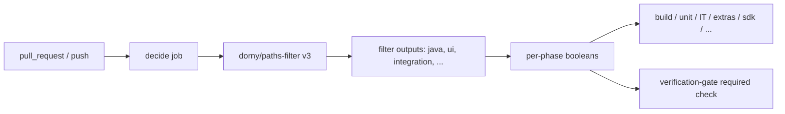

# RFC: Clear Node.js 20 GitHub Actions Deprecation Warnings

| Field | Value |
|-------|--------|
| **Status** | Proposed |
| **Type** | CI maintenance / dependency bump |
| **Priority** | High (hard failure window opens fall 2026) |
| **Audience** | Maintainers / CI owners |
| **Related** | [GitHub Changelog — Deprecation of Node 20 on Actions runners](https://github.blog/changelog/2025-09-19-deprecation-of-node-20-on-github-actions-runners/) |
| **Primary touchpoint** | `.github/workflows/verify.yaml` (`decide` job) |

---

## 1. Context gathered

### What the issue claims

Every **Verify** and **PR Lifecycle** run warns because some Actions still target Node.js 20. Named offenders:

| Action (per issue) | Warning |
|--------------------|---------|
| `dorny/paths-filter` | Targets Node.js 20, forced onto Node.js 24 |
| `actions/upload-artifact@v4` | Targets Node.js 20, forced onto Node.js 24 |

Impact claimed: warnings only today; after GitHub removes Node 20 fallback, those steps fail and **any PR can be blocked**.

### What this repo actually has today (local `main` inventory)

Actions are pinned by **commit SHA with a version comment** (existing convention — keep it).

| Pin in repo | Declared `runs.using` (fetched from pin’s `action.yml`) | Used by |
|-------------|----------------------------------------------------------|---------|
| `dorny/paths-filter@d1c1ffe…` **# v3** | **`node20`** | `verify.yaml` → `decide` → “Detect changed paths” |
| `actions/upload-artifact@043fb46…` **# v7** | **`node24`** | Verify + build/extras/ITs/operator/release |
| `actions/checkout@9c091bb…` # v7 | `node24` | Most workflows including PR Lifecycle |
| `actions/github-script@3a2844b…` # v9 | `node24` | PR Lifecycle (all handler jobs) |
| `actions/download-artifact@3e5f45b…` # v8 | (Node 24-era line) | Downstream Verify jobs |

**Upstream fix already exists for paths-filter:** [`dorny/paths-filter` v4.0.0+](https://github.com/dorny/paths-filter/releases/tag/v4.0.0) sets `using: node24`. Latest is **v4.0.2** (`7b450fff21473bca461d4b92ce414b9d0420d706`). Release notes for v4.0.0: no intentional input/output/behavior change — runtime bump only.

**PR Lifecycle** (`.github/workflows/pr-lifecycle.yml`) does **not** call `dorny/paths-filter` or `upload-artifact`. It only uses `checkout` + `github-script` (both already `node24`). Warnings attributed to “PR Lifecycle” are almost certainly from **Verify** (which PR Lifecycle observes via `workflow_run`), or from stale issue text.

**`upload-artifact@v4` is already gone on current `main`.** The issue’s second row is stale relative to this tree; no further bump is required for that specific Action unless another branch/fork still pins v4.

### How Verify uses paths-filter



Path filters drive which expensive phases run. A broken or behavior-changing bump in `paths-filter` can wrongly skip tests or over-run CI — so the upgrade must preserve filter YAML and output names.

---

## 2. Problem framing

### The gap

Workflows still reference at least one JavaScript Action whose `action.yml` declares `runs.using: node20`. GitHub already forces those Actions onto Node 24 (hence the annotation noise). When the Node 20 binary is removed from runners (**fall 2026**), any Action that has not been republished for `node24` (or replaced) will fail at step start — before our scripts run.

Timeline (from changelog):

- Node 20 EOL: April 2026  
- Node 24 default on runners: **June 16, 2026** (already past as of this RFC)  
- Node 20 removal: **fall 2026**  
- Temporary opt-out `ACTIONS_ALLOW_USE_UNSECURE_NODE_VERSION=true` only works until removal

### Representative failure scenario (illustrative)

A docs-only PR opens. `decide` runs `dorny/paths-filter@v3`. After Node 20 removal, that step exits with a runner/runtime error. `decide` never publishes `run-*` outputs. Downstream jobs mis-fire or the **verification-gate** (the single required check) fails. Merge is blocked for every PR, independent of the PR’s content.

### Why the gap exists

1. **Third-party Action runtime is opaque to Dependabot-style “app deps”.** We pin SHAs for supply-chain safety, but nothing in-repo asserts `runs.using != node20`.
2. **Upstream lagged, then jumped majors.** `paths-filter` stayed on `node20` through v3; Node 24 landed as **v4** (semver major for a runtime-only change).
3. **Partial upgrades already happened.** Official Actions (`checkout`, `upload-artifact`, `github-script`, …) were bumped to Node 24 majors; one critical third-party pin (`paths-filter` v3) was left behind — enough to keep warnings on every Verify run.

---

## 3. Design

### Goal

Eliminate Node 20 deprecation warnings from the **Verify** critical path, and reduce risk that fall 2026 runner changes break required checks — without changing path-filter semantics or PR lifecycle behavior.

### Non-goals

- Rewriting path detection (no custom shell/`git diff` replacement in v1)
- Changing PR Lifecycle orchestration logic
- Mandating `FORCE_JAVASCRIPT_ACTIONS_TO_NODE24` as a permanent workaround
- Fixing every optional/release-only Action in the same PR (tracked as Phase 2)

---

### Decision 1: Bump `dorny/paths-filter` v3 → v4.0.2 (SHA pin)

**Decision:** In `verify.yaml`, replace:

```yaml
uses: dorny/paths-filter@d1c1ffe0248fe513906c8e24db8ea791d46f8590 # v3
```

with:

```yaml
uses: dorny/paths-filter@7b450fff21473bca461d4b92ce414b9d0420d706 # v4.0.2
```

Keep the existing `with.filters` block unchanged.

**Alternatives considered:**

1. **Stay on v3 + set `FORCE_JAVASCRIPT_ACTIONS_TO_NODE24=true` / later `ACTIONS_ALLOW_USE_UNSECURE_NODE_VERSION=true`.** Hides or delays the problem; opt-out dies when Node 20 is removed; still depends on an Action that *declares* an unsupported runtime.
2. **Replace `dorny/paths-filter` with inline `git diff` / `tj-actions/changed-files` / GitHub `paths:` workflow filters.** Larger change; duplicates logic already documented in `.github/workflows/README.md`; `on.pull_request.paths` cannot express the current “decide + lifecycle label” combination cleanly.

**Why this one:** Upstream already shipped a Node 24 runtime with stated API compatibility. Matches how this repo already upgrades Actions (SHA + version comment). Minimal blast radius: one line in one job that every PR already executes.

**Precedent:** Same class of fix as bumping `actions/upload-artifact` from the Node 20 line (v4/v5) to v6+ (`node24`) — which this repo has already done to v7.

---

### Decision 2: Do not change `upload-artifact` on current `main`

**Decision:** Treat the issue’s `upload-artifact@v4` row as **already resolved** on this tree (pin is v7 / `node24`). No code change unless Phase 0 finds a remaining v4 pin on another ref.

**Alternatives:** Re-bump to newest patch for hygiene only — optional, not required for this RFC’s warning clearance.

**Why:** Avoid unrelated churn in a CI-fix PR.

---

### Decision 3: Scope PR Lifecycle out of the mandatory fix; mention in docs/issue reply

**Decision:** No PR Lifecycle workflow edits for the two Actions named in the issue.

**Why:** Those Actions are not referenced there. Clearing Verify warnings clears the noise people associate with the PR pipeline. If Phase 0 annotations still show Node 20 under a PR Lifecycle *job name*, investigate that annotation’s Action name separately (likely a different pin).

---

### Decision 4: Follow-up audit (Phase 2), not blocked on Phase 1

**Decision:** After the Verify fix, inventory remaining JS Actions that still declare `node20` or older, and bump before fall 2026 removal.

**Confirmed still `node20` (or older) on current pins (spot-check of `action.yml`):**

| Action pin | `runs.using` | Workflows (examples) | Urgency |
|------------|--------------|----------------------|---------|
| `dorny/paths-filter` v3 | `node20` | **Verify `decide`** | **P0 — this RFC** |
| `nick-fields/retry@ce71cc2…` | `node20` | `reusable-docker-build`, `verify-publish` | P1 (main publish path) |
| `docker/setup-buildx-action@8d2750c…` # v3 | `node20` | docker build / publish / release-images | P1 |
| `softprops/action-gh-release@3bb127…` | `node20` | `release.yaml` | P2 (release only) |
| `github/codeql-action/upload-sarif@…` | `node20` | `image-scan.yaml` | P2 |
| `stCarolas/setup-maven@…` | `node12` | `update-openapi.yaml` | P1/P2 |
| `crazy-max/ghaction-import-gpg@…` | `node12` | `release-artifacts.yaml` | P2 |

Phase 1 alone stops the **every-PR** Verify warning from `paths-filter`. Phase 2 prevents the next cliff when GitHub deletes Node 20 entirely.

---

### Decision 5: Verification strategy (no new test framework)

**Decision:** Use existing PR pipeline as the test harness.

Concrete checks after the bump:

1. Open a PR that touches only `.github/workflows/verify.yaml` (or a no-op under a watched path) so `ci` / path filters exercise `decide`.
2. Confirm the **Decide** job annotation log no longer lists `dorny/paths-filter` under Node.js 20 deprecation.
3. Confirm filter outputs still look sane (e.g. workflow-only change → `ci=true`; docs-only → Java phases skipped as today — see README table).
4. Confirm **verification-gate** still passes/fails according to existing rules.

Optional hardening (Phase 3): a tiny script in `scripts/` or a workflow step that `curl`s each `uses:` pin’s `action.yml` and fails if `using: node20|node16|node12` — only if maintainers want an ongoing guardrail. Not required to ship Phase 1.

---

### Concrete change (Phase 1)

```yaml
# .github/workflows/verify.yaml  (decide job)
- name: Detect changed paths
  uses: dorny/paths-filter@7b450fff21473bca461d4b92ce414b9d0420d706 # v4.0.2
  id: filter
  with:
    filters: |
      java:
        - 'app/**'
        # ... unchanged ...
```

No changes to filter keys, lifecycle label logic, or `verification-gate`.

---

## 4. Implementation plan

### Phase 0 — Confirm live warnings (≤30 min)

- Open a recent **Verify** run → Annotations / job log for `Decide`.
- Record exact Action names/versions in the warning (reconcile with issue text).
- If `upload-artifact@v4` still appears, find the pin (may be stale issue or non-`main` branch).

### Phase 1 — Clear Verify P0 warning (one PR)

1. Bump `dorny/paths-filter` to v4.0.2 SHA as above.
2. PR title suggestion: `ci(workflows): bump dorny/paths-filter to v4 for Node 24`.
3. Validation checklist in PR body (from Decision 5).
4. No application/Java code; checkstyle N/A; DCO + conventional commit still required.

**Dependency:** None. Can merge independently of Phase 2.

### Phase 2 — Full Actions runtime audit (separate PR(s))

1. Script or manual pass: for every `uses: owner/repo@sha`, resolve `action.yml` → `runs.using`.
2. Bump or replace each remaining `node20`/`node12` Action (prefer official majors that declare `node24`).
3. Prioritize paths on **required** or **every-PR** jobs (`verify-publish` / docker buildx / retry) before release-only.

### Phase 3 — Optional guardrails

- Dependabot/Renovate for `github-actions` ecosystem (if not already), **or**
- CI lint that rejects new `node20` pins.

---

## 5. Risks and tradeoffs

| Risk | Likelihood | Mitigation |
|------|------------|------------|
| v4 changes filter edge-case behavior despite “no functional changes” claim | Low | Keep filter YAML identical; compare `verify-decisions` / `verify-changes` artifacts on a sample PR |
| SHA pin typo / wrong tag | Low | Copy SHA from GitHub tag `v4.0.2` object; comment `# v4.0.2` |
| False confidence after Phase 1 (other Actions still node20) | Medium | Explicit Phase 2; don’t close the broader “Node 20 removal” concern when only paths-filter is fixed |
| Opt-out env vars used as “fix” | — | Reject in review; they expire at removal |

**Blast radius of Phase 1:** Only the `decide` job’s path-filter step. Wrong outputs could skip or over-run test phases and fail/pass `verification-gate` incorrectly — hence the explicit output sanity check on the PR.

---

## 6. Assumption ledger

| Assumption | Confidence |
|------------|------------|
| Issue text referring to `upload-artifact@v4` reflects an older tree; current `main` already uses v7/`node24` | **High** — verified pin + upstream `action.yml` |
| PR Lifecycle does not itself emit the two named warnings | **High** — workflow sources inspected |
| `dorny/paths-filter` v4.0.2 is API-compatible with our filter YAML and output names | **High** — upstream states no functional change; still validate on one PR |
| Fall 2026 Node 20 removal will fail steps whose Actions still declare `node20`, not only warn | **High** — GitHub changelog |
| Broader audit list above is complete for this repo | **Medium** — spot-checked common pins; composite Actions may wrap JS children not visible in top-level `action.yml` |

---

## 7. Recommendation

**Approve Phase 1 immediately:** one-line bump of `dorny/paths-filter` to **v4.0.2** in `verify.yaml`.

**Track Phase 2** as the real readiness work for Node 20 *removal* (retry, buildx, release Actions, etc.).

**Update the GitHub issue** to note: (1) `upload-artifact` already on v7/`node24` on `main`; (2) PR Lifecycle is not a consumer of the named Actions; (3) remaining risk is other `node20` pins outside the original table.

---

## Appendix A — Changelog dates (for reviewers)

From [Deprecation of Node 20 on GitHub Actions runners](https://github.blog/changelog/2025-09-19-deprecation-of-node-20-on-github-actions-runners/):

- Node 24 default: June 16, 2026  
- Opt-out with `ACTIONS_ALLOW_USE_UNSECURE_NODE_VERSION=true` until Node 20 removed  
- Node 20 removed: fall 2026  
- Users must update workflows to Action versions that run on Node 24  

## Appendix B — Out of scope for Phase 1 PR

- Application code, OpenAPI, storage variants  
- PR Lifecycle script/config changes  
- Dependabot config introduction (unless maintainers want it in the same PR)  
